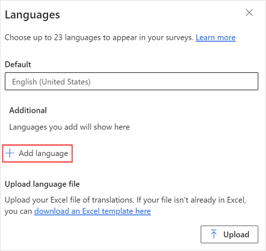
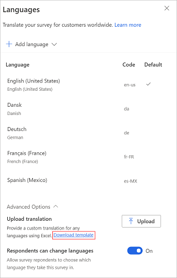

# Create a multilingual survey

You can create a multilingual survey by adding multiple languages to a single survey. You can then add translations for each language. This helps you increase your customer base and allows respondents to take the survey in their preferred language.

When you create a multilingual survey, respondents can choose their preferred language from the language selector at the upper-right corner of the survey.

 

**To create a multilingual survey**

1.	[Add survey language](#step-1-add-survey-language)
2.	[Add translations](#step-2-add-translations)

## Step 1: Add survey language

1.	Open the survey.

2.	On the **Design** tab, select **Customization** at the right side of the page, and then select **Languages**.

     

3.	In the **Languages** panel, select **Add language**.

    

4.	From the list of languages, browse to and select the language you want.

     

5.	If required, select **Add language** to add more languages. The added languages are displayed in the pane.

    

> [!NOTE]
> You can add up to 23 languages to your survey.

## Step 2: Add translations

You can choose from two options for adding translations:

1. [Translate all languages in bulk](#option-1-translate-all-languages-in-bulk)
2. [Translate individual languages](#option-2-translate-individual-languages)

### Option 1: Translate all languages in bulk

1. In the **Languages** panel, select **download an Excel template here** to download an Excel file containing strings in the primary language and columns for each of the selected languages. For example, **es** for Spanish or **fr** for French.

    

3. Open the Excel file and add translations for each language in its respective column.

4. After adding translations for all languages in the Excel file, go to the **Languages** panel, and then select **Upload**.

     

5. Browse to and select the Excel file in which you have added translations.

After uploading the Excel file, you can preview the survey to see whether everything works as expected. Select the language from the language selector at the upper-right corner of the survey.

> [!NOTE]
> - The first column in the Excel file contains strings in the primary language and isn't editable.
> - You must ensure that a translation for each string is provided in the Excel file.
> - We recommend that you download the latest Excel file every time you add or edit the translations. This ensures that the latest strings and languages are available.
> - We recommend that you _not_ make a copy of the Excel file and add strings to it, or change the file name extension. These actions might result in upload failure.

### Option 2: Translate individual languages

1.	In the **Languages** panel, hover over the language for which you want to add translations, and then select the **Edit** icon.

    

2.	Select the survey element, and then enter the translated text. Repeat this step for all survey elements.

     

3.	After you've added translated text for all elements in the survey, select **Back** in the upper-left corner of the page to go back to the **Languages** panel.

4.	Repeat steps 1 through 3 to add translations for other languages.

After adding translations for all languages, you can preview the survey to see whether everything works as expected. Select the language from the language selector at the upper-right corner of the survey.

 

## Manage translations  

After adding translations for the required languages in your survey, you can edit the existing translation or delete a language.

1.	Open the multilingual survey.

2.	On the **Design** tab, select **Customization** at the right side of the page, and then select **Languages**.

    

3.	To edit the translations, hover over the language for which you want to edit translations, and then select the **Edit** icon.

    

    > [!NOTE]
    > To edit all languages together, follow the steps in [Option 1: Translate all languages in bulk](#option-1-translate-all-languages-in-bulk).

4.	Edit the translations as required.

5.	To delete a language, hover over the language to be deleted, and then select the **Delete** icon.

     

## Locale codes to use in survey variable

When you create a multilingual survey, you can use the **locale** survey variable to set the default language for displaying the survey. You must use the language codes as provided in the following table:

| ISO Code       | Dialect                                          |
|----------------|--------------------------------------------------|
| af             | Afrikaans                                        |
| am-et          | Amharic                                          |
| ar             | Arabic                                           |
| as-in          | Assamese - India                                 |
| az-latn-az     | Azerbaijani - Latin script                       |
| bg             | Bulgarian                                        |
| bn-in          | Bangla - India                                   |
| bs-latn-ba     | Bosnian - Latin, Bosnia & Herzegovina            |
| ca             | Catalan                                          |
| ca-es-valencia | Catalan - Valencia                               |
| cs             | Czech                                            |
| cy-gb          | Welsh                                            |
| da             | Danish                                           |
| de             | German                                           |
| el             | Greek                                            |
| en-gb          | English - UK                                     |
| en-us          | English - US                                     |
| es             | Spanish - Spain, International Sort              |
| es-mx          | Spanish - Mexico                                 |
| et             | Estonian                                         |
| eu             | Basque                                           |
| fa             | Farsi                                            |
| fi             | Finnish                                          |
| fil-ph         | Filipino                                         |
| fr             | French - France                                  |
| fr-ca          | French - Canada                                  |
| ga-ie          | Irish - Ireland                                  |
| gd             | Gaelic - Scotland                                |
| gl             | Galician                                         |
| gu             | Gujarati                                         |
| he             | Hebrew                                           |
| hi             | Hindi                                            |
| hr             | Croatian                                         |
| hu             | Hungarian                                        |
| id             | Indonesian                                       |
| is             | Icelandic                                        |
| it             | Italian                                          |
| ja             | Japanese                                         |
| ka             | Georgian                                         |
| kk             | Kazakh                                           |
| km-kh          | Khmer                                            |
| kn             | Kannada                                          |
| ko             | Korean                                           |
| kok            | Konkhani                                         |
| lb-lu          | Luxembourg - Luxembourgish                       |
| lo             | Lao                                              |
| lt             | Lithuanian                                       |
| lv             | Latvian                                          |
| mi-nz          | Maori - New Zealand                              |
| mk             | Macedonian (FYROM)                               |
| ml             | Malayalam                                        |
| mr             | Marathi                                          |
| ms             | Malay                                            |
| mt-mt          | Maltese - Malta                                  |
| nb-no          | Bokmål - Norway                                  |
| ne-np          | Nepal - Nepali                                   |
| nl             | Dutch                                            |
| nn-no          | Nynorsk - Norway                                 |
| or-in          | Oriya - India                                    |
| pa             | Punjabi                                          |
| pl             | Polish                                           |
| pt-br          | Portuguese - Brazil                              |
| pt-pt          | Portuguese                                       |
| quz-pe         | Quechua - Peru                                   |
| ro             | Romanian                                         |
| ru             | Russian                                          |
| sk             | Slovak                                           |
| sl             | Slovenian                                        |
| sq             | Albanian                                         |
| sr-cyrl-ba     | Serbian (Cyrillic script) - Bosnia & Herzegovina |
| sr-cyrl-rs     | Serbian (Cyrillic script) - Serbia               |
| sr-latn-rs     | Serbian (Latin script) - Serbia                  |
| sv             | Swedish                                          |
| ta             | Tamil - India                                    |
| te             | Telugu                                           |
| th             | Thai                                             |
| tk-tm          | Turkmen (Latin script)                           |
| tr             | Turkish                                          |
| ug             | Uyghur                                           |
| uk             | Ukrainian                                        |
| ur             | Urdu                                             |
| vi             | Vietnamese                                       |
| zh             | Chinese (traditional)                            |
| zh-cn          | Chinese (simplified)                             |
|||

### See also

[Add and configure satisfaction metrics](satisfaction-metrics.md) 
[Add logic by creating branching rules](create-branching-rule.md) 
[Personalize your survey by adding variables](personalize-survey.md) 
[Add branding to your survey](survey-branding.md) 
[Add formatting to your survey](survey-formatting.md) 
[Add formatting to survey elements](survey-text-format.md)
