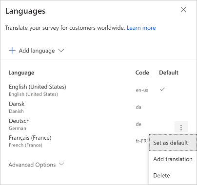
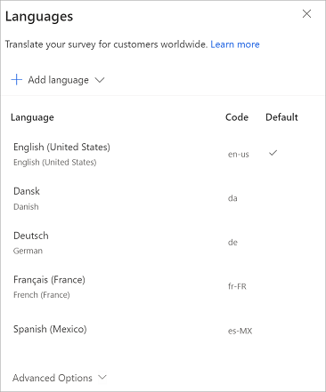
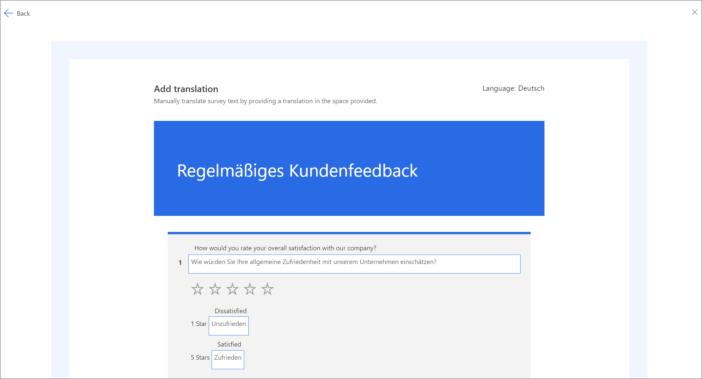
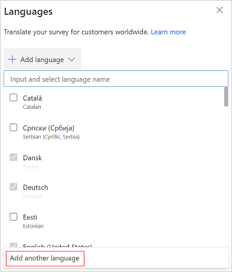
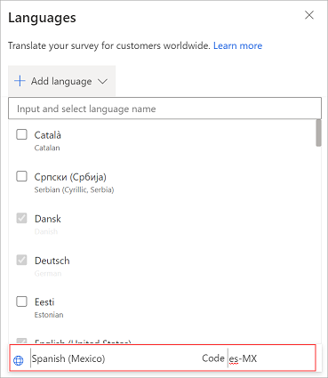
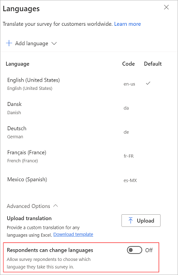

# Create a multilingual survey

A survey created in Dynamics 365 Customer Voice can be translated to multiple languages. This translated survey is known as multilingual survey. To create a multilingual survey, you must first add the languages and then add translations for each of the added language. This helps you increase your customer base and allows respondents to take the survey in their preferred language.

When you create a multilingual survey, you can also allow respondents to choose their preferred language from the language selector at the upper-right corner of the survey. More information: [Allow respondents to change survey language](#allow-respondents-to-change-survey-language)

 

To create a multilingual survey, you must first add a language (additional or custom) and then add translations for the corresponding strings in the survey.

> [!NOTE]
> Dynamics 365 Customer Voice supports 45 languages out-of-the-box. You can also add custom languages as per the requirement.

## Language types available in Dynamics 365 Customer Voice

### Default language

Default language is the language in which the survey is originally created. The default language can be selected from a list of languages supported in Dynamics 365. By default, the language in which you are using the application is set as the default language. You can change it as per your requirement. More information: [Change the default language](#change-the-default-language)

### Additional languages

Additional languages are the languages in which a survey can be rendered in addition to the default language. Additional languages can be selected from a list of languages supported in Dynamics 365. These languages can be added, edited, and deleted from the Dynamics 365 Customer Voice interface. The system strings are translated automatically. More information: [Add additional languages](#add-additional-languages)

### Custom languages

Custom languages are the languages that are not included in the list of Dynamics 365 supported languages. These languages can be added, edited, and deleted from the Dynamics 365 Customer Voice interface. The system strings are not translated automatically and are visible in the survey's default language. More information: [Add custom languages](#add-custom-languages)

> [!NOTE]
> - Prior to the date release, Office 365 supported languages were included into additional languages. After the date release, languages that are supported by Office 365 but not Dynamics 365, will be treated as custom languages and must be added through the Excel file.
> - If you've created a survey before this date and added an additional language that is supported by Office 365 but not Dynamics 365, will have its **Edit** button disabled. You must edit the translations by using the Excel file.

### Fallback language

Language in which a survey is rendered if translation for the survey is not available. The fallback language transition is handled internally by the system, and the response page is automatically rendered in the available fallback language.

## Change the default language

You can change the default language for your survey from the **Languages** panel. Note that you can change the default language only when multiple languages are added to the survey.

1. Open the survey.

2. On the **Design** tab, select **Customization** at the right side of the page, and then select **Languages**.

3. From the list of languages, hover over a language, select **More options** (three dots), and then select **Set as default**.

    

    The default language is marked with  in the **Default** column.

## Add additional languages

You can add additional languages to your survey from the **Languages** panel. After adding the languages, you can add translations either in bulk for all languages or to each individual language. The system strings are translated automatically.

### Step 1: Add additional language

1. Open the survey.

2. On the **Design** tab, select **Customization** at the right side of the page, and then select **Languages**.

3. In the **Languages** panel, select **Add language**.

4. From the list of languages, browse to and select the languages you want.

    

    > [!NOTE]
    > You can select multiple languages by selecting the check boxes next to each language.

5. Select anywhere in the **Languages** panel to save the changes.

    The added languages are displayed in the panel.

    

### Step 2: Add translations

After adding languages, you can choose from two options for adding translations:

-  Translate all languages in bulk

-  Translate individual languages

#### Option 1: Translate all languages in bulk

1. In the **Languages** panel, expand **Advanced options**, and then select **Download template** to download an Excel file containing strings in the primary language and columns for each of the selected languages. For example, **de** for German or **fr-FR** for French.

    

2. Open the Excel file and add translations for each language in its respective column.

3. After adding translations for all languages in the Excel file, go to the **Languages** panel, expand **Advanced options**, and then select **Upload**.

4. Browse to and select the Excel file in which you have added translations.

After uploading the Excel file, you can preview the survey to see whether everything works as expected. Select the language from the language selector at the upper-right corner of the survey.

> [!NOTE]
> - The first column in the Excel file contains strings in the primary language and isn't editable.
> - You must ensure that a translation for each string is provided in the Excel file.
> - We recommend that you download the latest Excel file every time you add or edit the translations. This ensures that the latest strings and languages are available.
> - We recommend that you _not_ make a copy of the Excel file and add strings to it, or change the file name extension. These actions might result in upload failure.

#### Option 2: Translate individual languages

1. In the **Languages** panel, select the language for which you want to add translations.

   Alternately, you can also hover over a language, select **More options** (three dots), and then select **Add translation**.

2. Select the survey element, and then enter the translated text. Repeat this step for all survey elements.

    

3. After you've added translated text for all elements in the survey, select **Back** in the upper-left corner of the page to go back to the **Languages** panel.

4. Repeat steps 1 through 3 to add translations for other languages.

After adding translations for all languages, you can preview the survey to see whether everything works as expected. Select the language from the language selector at the upper-right corner of the survey.

 

## Add custom languages

You can add custom languages to your survey from the **Languages** panel. After adding the languages, you can add translations either in bulk for all languages or to each individual language. The system strings are not translated automatically and are visible in the survey's default language.

1. Open the survey.

2. On the **Design** tab, select **Customization** at the right side of the page, and then select **Languages**.

3. In the **Languages** panel, select **Add language**, and then select **Add another language**.

   

4. In the **Enter language name** field, enter the name of the custom language you want to add.

5. In the **Enter code** field, enter the code of the custom language.

   

6. Select anywhere in the **Languages** panel to save the changes.

7. Repeat steps 3 through 6 to add more custom languages.

To add translations for custom languages, follow the steps mentioned in the [Step 2: Add translations](#step-2-add-translations) section.

## Allow respondents to change survey language

If you've created a multilingual survey, you can choose if your respondents can select a preferred language to respond to the survey or view the survey in the language selected as per their browser language, locale variable, or the survey URL. By default, respondents are not allowed to change their survey language.

**To allow respondents to change their survey language**

1. Open the survey.

2. On the **Design** tab, select **Customization** at the right side of the page, and then select **Languages**.

3. In the **Languages** panel, expand **Advanced options**, and then turn on the **Respondents can change languages** toggle.

   

## Manage translations

After adding translations for the required languages in your survey, you can edit the existing translation or delete a language.

1. Open the multilingual survey.

2. On the **Design** tab, select **Customization** at the right side of the page, and then select **Languages**.

3. To edit the translations, select the language for which you want to edit translations.

4. Edit the translations as required.

5. To delete a language, hover over the language to be deleted, select **More options** (three dots), and then select **Delete**.

## Locale codes to use in survey variable

When you create a multilingual survey, you can use the **locale** survey variable to set the default language for displaying the survey. You must use the language codes as provided in the following table:

| Language code  | Language                                         |
|----------------|--------------------------------------------------|
| af             | Afrikaans                                        |
| am-et          | Amharic                                          |
| ar             | Arabic                                           |
| as-in          | Assamese - India                                 |
| az-latn-az     | Azerbaijani - Latin script                       |
| bg             | Bulgarian                                        |
| bn-in          | Bangla - India                                   |
| bs-latn-ba     | Bosnian - Latin, Bosnia & Herzegovina            |
| ca             | Catalan                                          |
| ca-es-valencia | Catalan - Valencia                               |
| cs             | Czech                                            |
| cy-gb          | Welsh                                            |
| da             | Danish                                           |
| de             | German                                           |
| el             | Greek                                            |
| en-gb          | English - UK                                     |
| en-us          | English - US                                     |
| es             | Spanish - Spain, International Sort              |
| es-mx          | Spanish - Mexico                                 |
| et             | Estonian                                         |
| eu             | Basque                                           |
| fa             | Farsi                                            |
| fi             | Finnish                                          |
| fil-ph         | Filipino                                         |
| fr             | French - France                                  |
| fr-ca          | French - Canada                                  |
| ga-ie          | Irish - Ireland                                  |
| gd             | Gaelic - Scotland                                |
| gl             | Galician                                         |
| gu             | Gujarati                                         |
| he             | Hebrew                                           |
| hi             | Hindi                                            |
| hr             | Croatian                                         |
| hu             | Hungarian                                        |
| id             | Indonesian                                       |
| is             | Icelandic                                        |
| it             | Italian                                          |
| ja             | Japanese                                         |
| ka             | Georgian                                         |
| kk             | Kazakh                                           |
| km-kh          | Khmer                                            |
| kn             | Kannada                                          |
| ko             | Korean                                           |
| kok            | Konkhani                                         |
| lb-lu          | Luxembourg - Luxembourgish                       |
| lo             | Lao                                              |
| lt             | Lithuanian                                       |
| lv             | Latvian                                          |
| mi-nz          | Maori - New Zealand                              |
| mk             | Macedonian (FYROM)                               |
| ml             | Malayalam                                        |
| mr             | Marathi                                          |
| ms             | Malay                                            |
| mt-mt          | Maltese - Malta                                  |
| nb-no          | Bokmål - Norway                                  |
| ne-np          | Nepal - Nepali                                   |
| nl             | Dutch                                            |
| nn-no          | Nynorsk - Norway                                 |
| or-in          | Oriya - India                                    |
| pa             | Punjabi                                          |
| pl             | Polish                                           |
| pt-br          | Portuguese - Brazil                              |
| pt-pt          | Portuguese                                       |
| quz-pe         | Quechua - Peru                                   |
| ro             | Romanian                                         |
| ru             | Russian                                          |
| sk             | Slovak                                           |
| sl             | Slovenian                                        |
| sq             | Albanian                                         |
| sr-cyrl-ba     | Serbian (Cyrillic script) - Bosnia & Herzegovina |
| sr-cyrl-rs     | Serbian (Cyrillic script) - Serbia               |
| sr-latn-rs     | Serbian (Latin script) - Serbia                  |
| sv             | Swedish                                          |
| ta             | Tamil - India                                    |
| te             | Telugu                                           |
| th             | Thai                                             |
| tk-tm          | Turkmen (Latin script)                           |
| tr             | Turkish                                          |
| ug             | Uyghur                                           |
| uk             | Ukrainian                                        |
| ur             | Urdu                                             |
| vi             | Vietnamese                                       |
| zh             | Chinese (traditional)                            |
| zh-cn          | Chinese (simplified)                             |
|||

## Frequently asked questions

### What happens to existing surveys?

For surveys created before the date release, following is the behavior:

-   If your survey's default language is set to a language that is supported by Office 365 but not Dynamics 365, the default language will be changed to a Dynamics 365 supported language.

-   Additional languages that are supported by Dynamics 365 can be edited from the Dynamics 365 Customer Voice interface.

-   Additional languages that are not supported by Dynamics 365 cannot be edited from the Dynamics 365 Customer Voice interface. The **Edit** button will be shown as disabled. These will be treated as custom languages and must be edited through an Excel file.

### How is a survey language chosen?

When a respondent opens a survey in a web browser, the survey looks for any explicit language code specified in the survey URL (as a language code or locale variable). If a language code is not specified in the survey URL, the survey is loaded in the web browser's language.

**Assumption**: The survey creator has added Dynamics 365 supported languages as additional languages and provided corresponding translations.

**Scenario 1**: Respondent's web browser language is a Dynamics 365 supported language.

The respondent's browser language is set to French (fr) and French (fr) has been added as an additional language to the survey and translation has been provided. Once the web browser's language code is matched with the additional language code, the survey is loaded in French.

**Scenario 2**: Respondent's web browser language is not a Dynamics 365 supported language, but an Office 365 supported language.

The respondent's web browser language is set to Mexican Spanish (es-MX). However, es-MX language code is not supported in Dynamics 365 but supported in Office 365. Therefore, the survey looks up for the fallback language, Castilian Spanish (es-ES) in this case and display the survey in the fallback language (Castilian Spanish).

**Scenario 3**: Respondent's web browser language is neither a Dynamics 365 supported language nor an Office 365 supported language.

The respondent's web browser language is set to Bemba – Zambia (bem- ZM) which is not supported by both Dynamics 365 and Office 365. In this case, the survey checks for any available fallback language or else default to the final fallback language. The survey will be displayed in the default language code (en-us) which has been defined in the survey.

### See also

[Add and configure satisfaction metrics](satisfaction-metrics.md) 
[Add logic by creating branching rules](create-branching-rule.md) 
[Personalize your survey by adding variables](personalize-survey.md) 
[Add branding to your survey](survey-branding.md) 
[Add formatting to your survey](survey-formatting.md) 
[Add formatting to survey elements](survey-text-format.md)

[!INCLUDE[footer-include](includes/footer-banner.md)]
