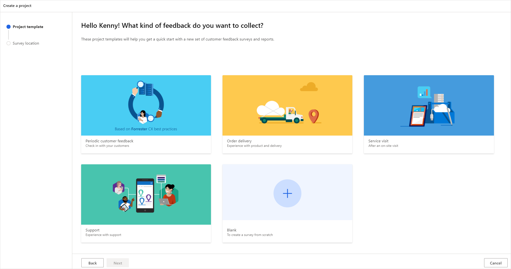
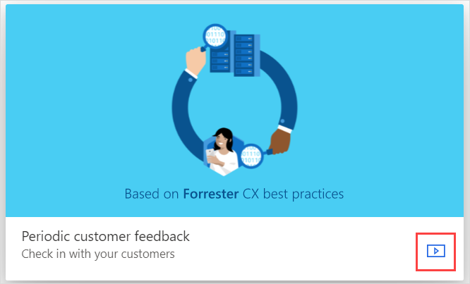
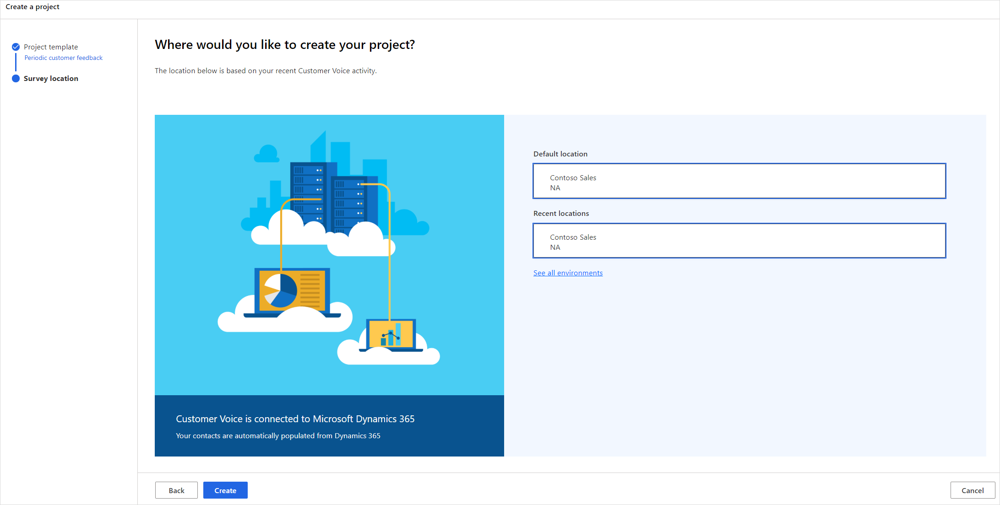

# Create a project

A project is a container that consists of surveys, satisfaction metrics, Power Automate flows, and reports. You can create, distribute, and analyze a survey by creating a project. A project can be created by using one of the ready-to-use project templates or from scratch by using a blank template.

Customer Voice offers ready-to-use feedback project templates that include survey questions, workflows, and relevant reports. Each project template includes industry best-practice survey questions and pre-configured satisfaction metrics and workflows for Dynamics 365 business applications. The available project templates are:

- **Customer pulse**: The customer pulse template is based on Forrester Research customer experience (CX) best practices and includes questions to collect customer sentiment at regular intervals.

- **Order delivery**: The Order delivery template allows you to collect timely feedback after an order is delivered. It also includes a workflow to automate sending a survey after an order is complete. The survey is sent to the customer and the response is automatically integrated with the order and customer records.

- **Service visit**: The Service visit template allows you to collect timely feedback following a customer visit scheduled with the Dynamics 365 Field Service application. The feedback is automatically integrated to the customer visit record in Dynamics 365, get insights including trends and specific follow-up actions to make sure customer issues are addressed in a timely manner.

- **Support**: The Support template provides an out-of-the-box end-to-end solution for measuring customer satisfaction for your Dynamics 365 case management process. The template includes typical questions and setup needed for the customer service scenario.

- **Blank**: The Blank template allows you to create a survey from scratch and configure it as per your requirements. This will not contain any pre-configured survey questions, workflows, and satisfaction metrics.

## Create a project from a template

Creating a project from a template helps you quickly get started as per your surveying requirement with little or no customization. The templates include industry best-practice survey questions and is curated by subject-matter experts.

1. Sign in to Customer Voice.

2. On the **All projects** tab, select **New project**.

     

     The **Project template** page is displayed with the available project templates.

      

3. To see the survey questions in a project template, hover over the template, and select the preview icon.

     

4. Select the required project template, and then select **Next**.

5. On the **Survey location** page, select an environment to create the project. To see all environments, select **See all environments**.

    

6. On the **All environments** window, select the required environment, and then select **Select and close**.

7. On the **Survey location** page, select **Create**.

The project will be created with the survey questions, satisfaction metrics, and Power Automate flows. Configure the survey as required or continue with distributing the survey.

## Create a project from blank

Creating a project from blank gives you the freedom to choose survey questions, create satisfaction metrics, Power Automate flows, and customize it the way you want.

1. Sign in to Customer Voice.

2. On the **All projects** tab, select **New project**.

3. On the **Project template** page, select **Blank**.

4. Select **Next**.

5. On the **Survey location** page, select an environment to create the project. To see all environments, select **See all environments**.

6. On the **All environments** window, select the required environment, and then select **Select and close**.

7. On the **Survey location** page, select **Create**.

The project will be created with an empty survey. You can now add questions and customize it the way you want.