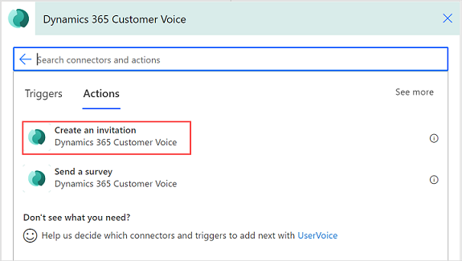
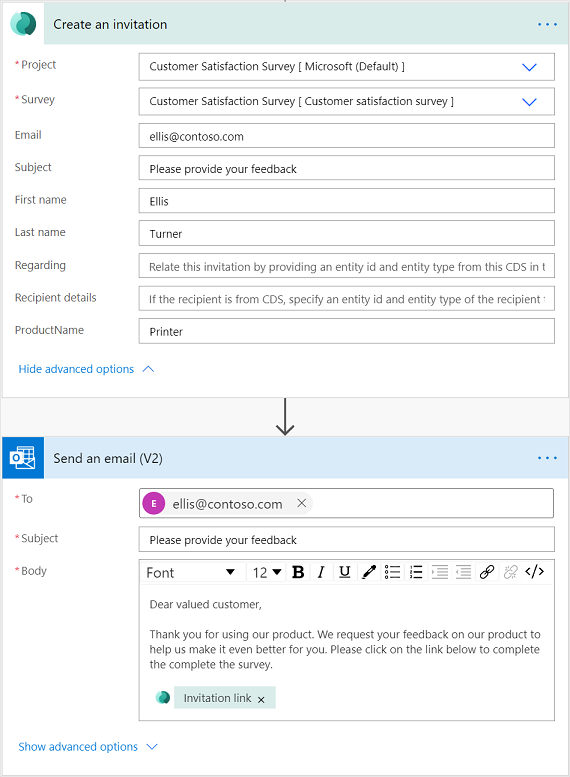

# Create a survey invitation

[!INCLUDE[cc-data-platform-banner](includes/cc-data-platform-banner.md)]

If you want to send a survey by using a platform other than Dynamics 365 Customer Voice&mdash;such as Outlook, Gmail, or SMS&mdash;you can create a survey invitation by using Power Automate. The survey invitation creates a personalized link that can be distributed by using the platform of your choice. The survey invitation link will be a short URL that can be easily distributed by the platforms that have a lower character limit (for example, SMS or Twitter). The short URL will be in the following format: `https://<region>.microsoft.com/<10-digit code>`

> [!NOTE]
> - When you create a survey invitation, the email address is considered as-is, and is not validated for correctness.
> - Once you create a survey invitation, it can't be updated. If some update is required, you must create a new invitation link.
> - The output of this action will be InviteId, InviteUrl, and UnsubscribeUrl.

1. Sign in to [flow.microsoft.com](https://flow.microsoft.com).

2. Start to create a flow from scratch. More information: [Create a flow in Power Automate](/flow/get-started-logic-flow)

3. In the flow editor, add a trigger to start your flow.

4. After adding the trigger, add a new step, and search for the **Dynamics 365 Customer Voice** connector.

5. In search results, select **Dynamics 365 Customer Voice**.

      

6. Select the **Create an invitation** action.

      

7. In the **Create an invitation** action, enter or select the following information:

    - **Project**: Select the project that contains a survey to be sent.
    - **Survey**: Select the survey to be sent.
    - **Email**: Enter the recipient's email address.
    - **Subject**: Enter the subject of the survey invitation.
    - **Regarding**: Specify a record to associate the survey invitation and response. This value is stored in the survey invitation's **Regarding** field.
        > [!NOTE]
        > - You must enter a table's logical name in this field. For example, if you want to associate the Case table, you must enter _incident_, as it is the logical name of the Case table. Similarly, if you create a custom table with its display name as _Custom Table_ and its logical name as _new\_customtable_, you must enter _new\_customtable_ in this field.
        > - Only tables that are marked for collaboration in activities are supported. For example, the Task table is not supported.
    - **Recipient details**: Specify a contact to associate your survey invitation and response records with. This value is stored in the survey invitation's **To** field. Only a Contact record is supported in this field.

    > [!NOTE]
    > - You must enter a value either in **Email** or **Recipient details** field for executing the **Create an invitation** action.
    > - If you want to associate your survey invitation and response with Microsoft Dataverse, you must enter values in **Regarding** and **Recipient details** fields, respectively. You must also ensure that **Save invited participants as Contacts** is turned on in [survey distribution settings](distribution-settings.md#participants). If **Save invited participants as Contacts** isn't turned on, the survey invitation's **To** field isn't populated. For more information about **Regarding** and **Recipient details** fields and how they're stored in the survey invitation, see [Send a survey action](send-survey-flow.md#send-a-survey-action).
    > - If you've used variables in your survey, they'll be visible in this action and you can specify the values accordingly. More information: [Specify values in a flow](personalize-survey.md#specify-values-in-a-flow)

8. Add a new step, and then select the action to send the email. You can use providers such as Outlook, Gmail, or SMS; we've used Outlook to send the survey in this procedure.

9. In the **Send an email** action, do the following:

    - **To**: Enter the recipient's email address.
    - **Subject**: Enter the subject of the email.
    - **Body**: Enter the text you want for the body of the email, and add the **Invitation link** dynamic content.

  After entering the required details, the flow looks as shown in the following image:

   

  The flow runs in accordance with the configured trigger, and then sends the survey.

### See also

[Work with survey distribution settings](distribution-settings.md) 
[Send a survey by using the built-in email composer](send-survey-email.md) 
[Send a survey by using Power Automate](send-survey-flow.md) 
[Embed a survey in a webpage](embed-web-page.md) 
[Send a survey link to others](send-survey-link.md) 
[Send a survey by using QR code](send-survey-qrcode.md)

[!INCLUDE[footer-include](includes/footer-banner.md)]
