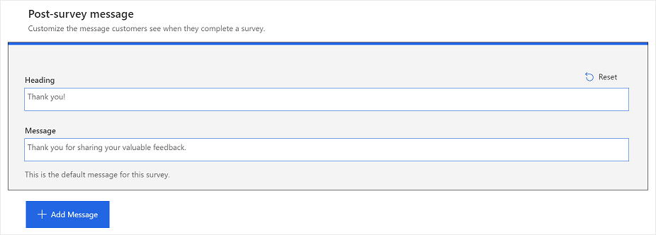
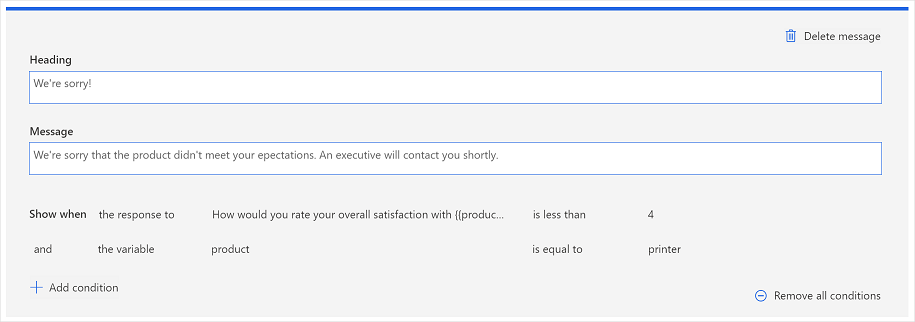
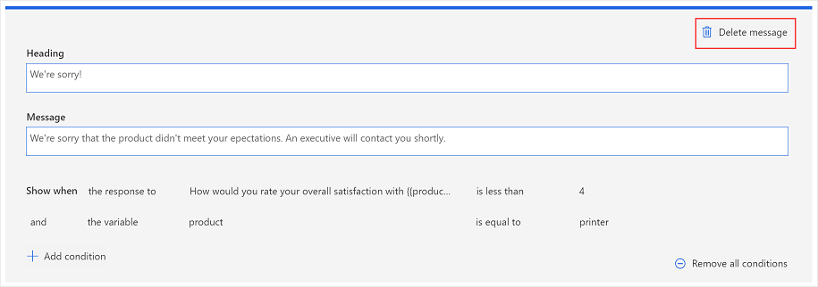

# Customize post-survey message

A post-survey message is displayed to respondents after they submit a survey. Default content is available for the post-survey message; however, you can add your own content to customize it in accordance with your requirements. You can also add up to four post-survey messages (in addition to the default message) and add conditions to show the appropriate post-survey message as per a question's response or a variable's value. The maximum number of characters supported in the message header and message body are 200 and 1000 respectively.

You can personalize the post-survey message by adding variables in the message header and body. For information on adding variables to survey elements, see [Add variables in a survey](personalize-survey.md#add-variables-in-a-survey)

You can add formatting to the post-survey message by changing their font style, font size, and color. You can also add a link to the message by selecting **Link** on the formatting toolbar and then adding the link through the link editor. More information: [Format text in a survey](survey-text-format.md)

If you've created a multilingual survey, you can add translations to post-survey messages for each added language. For information on adding languages and translations, see [Create a multilingual survey](create-multilingual-survey.md)

## Customize the default post-survey message

1. Open the survey.

2. On the **Design** tab, scroll to the bottom of the survey designer.

3. In the **Post-survey message** section, select the default message.

    

4. Update the text in **Heading** and **Message** fields.

    

5. To revert your changes to the default text, select **Reset**.

## Add a new post-survey message

1. Open the survey.

2. On the **Design** tab, scroll to the bottom of the survey designer.

3. In the **Post-survey message** section, select **Add Message**.

    

4. Add text in **Heading** and **Message** fields.

5. In the **Show when** field, select one of the following:

    - **the response to**: Select this option when the message is to be displayed according to a question's response. After selecting this option, select the question, operator, and the response.

    - **the variable**: Select this option when the message is to be displayed according to a variable's value. After selecting this option, select the variable, operator, and its value.

    You can add more conditions by using **and/or** operators by selecting **Add condition**.

    

6. To remove a branching condition, hover over the condition, and then select **Remove**.

7. To remove all branching conditions, select **Remove all conditions**.

## Delete a post-survey message

1. Open the survey.

2. On the **Design** tab, scroll to the bottom of the survey designer.

3. In the **Post-survey message** section, select the message you want to delete.

4. Select **Delete message**.

    

### See also

[Create a project](create-project.md) 
[Create a survey](create-survey.md) 
[Manage surveys](manage-surveys.md) 
[Manage projects](manage-projects.md)
