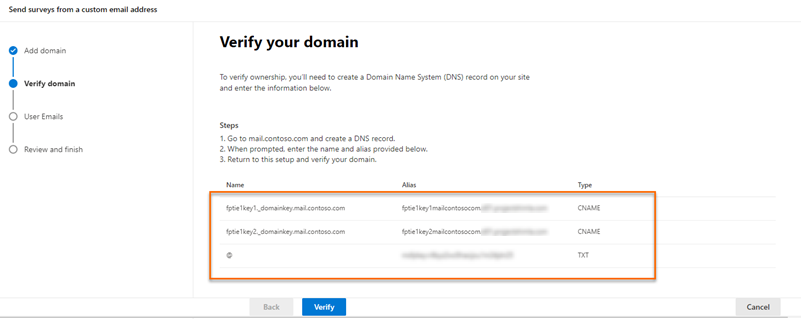
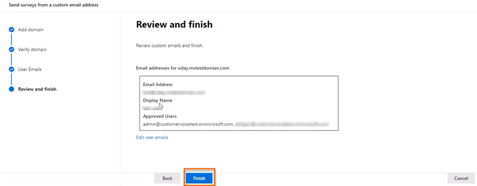
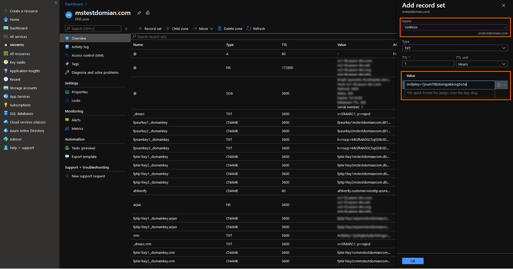
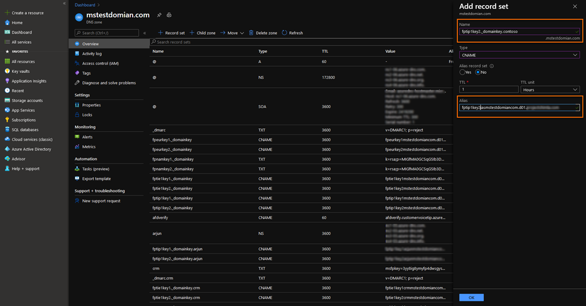

# Customize the sender's email address

[!INCLUDE[cc-data-platform-banner](includes/cc-data-platform-banner.md)]

By default, surveys are sent from the `surveys@email.customervoice.microsoft.com` email address. The email customization feature helps you create a custom email address based on your organization's domain. You can use then use this custom email address to send survey invitations to your customers.

Let's say your company is Contoso Suites, and the company's website is `www.contososuites.com`. You want to create two custom email addresses based on your company's domain, such as `noreply@contososuites.com` and `support@contososuites.com`.

## Add custom email addresses

Take the following steps to add custom email addresses:

1.	Sign in to [Microsoft 365 admin center](https://admin.microsoft.com/) with your work or school account.

2.	Select **Settings** > **Org settings**.

3.	On the **Org settings** page, under the **Services** tab, select **Dynamics 365 Customer Voice**.   
    > [!div class="mx-imgBorder"]
    > 

4.	In the **Dynamics 365 Customer Voice** panel, go to the **Send surveys from a custom email address** section and select **+ Add domain**.    
    > [!div class="mx-imgBorder"]
    > 
 
5.	On the **Add domain** page, enter the domain name of the email domain you want to create in **Enter your URL**, and then select **Next**.     
    > [!div class="mx-imgBorder"]
    > 
 
6.	Create DNS records in your domain by using the values available under the **Create DNS record** section on the **Verify you own this domain** page. More information: [Example DNS records](#example-dns-records).    
    > [!div class="mx-imgBorder"]
    > 
 
7.	After creating DNS records, select **Verify**.     
    > [!div class="mx-imgBorder"]
    > 

    >[!NOTE]
    >If the DNS records are not created, an error is displayed specifying that the application is unable to create a key and the domain can't be created.

8.	On the **User emails** page, enter the following information:    
    - **Email address**: Email address to use for sending survey invitation.
    - **Display name**: Display name for the email user.
    - **Approved users**: Users who can use custom email addresses when sending survey invitations.     
    > [!div class="mx-imgBorder"]
    >     

    >[!NOTE]
    >To add more email addresses, select **Add more emails**, and then provide the required information.
 
10.	After adding the required email addresses, select **Next**.

11.	On the **Review and finish** page, review the entered information, and then select **Finish**.    
    > [!div class="mx-imgBorder"]
    >   
 
12.	A confirmation message is displayed that the custom email address is created, select **Done**.    
    > [!div class="mx-imgBorder"]
    > 

The custom email address is displayed in the **Dynamics 365 Customer Voice** panel.
  
## Edit custom email addresses

After creating a custom email address, you can edit it to change its address, display name, and modify the users allowed to use the email.

1.	Sign in to [Microsoft 365 admin center](https://admin.microsoft.com/) with your work or school account.

2.	Select **Settings** > **Org settings**.

3.	On the **Org settings** page, under the **Services** tab, select **Dynamics 365 Customer Voice**.

4.	In the **Dynamics 365 Customer Voice** panel, hover over the email address you want to edit, select the ellipsis button, and then select **Edit custom email**.
 
5.	In the **Edit custom email** panel, edit the required information, and then select **Save**.
 
## Delete custom email addresses

You can delete custom email addresses that are no longer required.

1.	Sign in to [Microsoft 365 admin center](https://admin.microsoft.com/) with your work or school account.

2.	Select **Settings** > **Org settings**.

3.	On the **Org settings** page, under the **Services** tab, select **Dynamics 365 Customer Voice**.

4.	In the **Dynamics 365 Customer Voice** panel, hover over the email address that you want to delete, select the ellipsis button, and then select **Delete custom email**.
 
5.	In the confirmation dialog box, select **Remove**.

## Example DNS records

### TXT record

`TXT name: @`    
`TXT value: msfpkey=abc123abc123abc123abc123`

In this example screen, we're using Microsoft Azure to add the TXT name and value:

> [!div class="mx-imgBorder"]
> 

### CNAME record

`Host name or Alias: fpeurkey1.\_domainkey`      
`Points to address: fpeurkey1contosocom.d01.formspro.dynamics.com`

>[!NOTE]
>You must create two CNAME records using the information provided in step 6 of [Add custom email addresses](#add-custom-email-addresses).

In this example screen, we're using Microsoft Azure to add the CNAME alias and address:

> [!div class="mx-imgBorder"]
> 

## Frequently asked questions

### Should the email account be a functioning account, or can it be a dummy account?

The email account need not be a functioning account to send emails; however, a mailbox must be configured if the account is expected to receive replies. In most cases, the email address from which survey emails are sent is an unmonitored email account and need not receive emails.

### See also

[Work with survey distribution settings](distribution-settings.md) 
[Send a survey by using email](send-survey-email.md) 
[Send a survey by using Power Automate](send-survey-flow.md) 
[Embed a survey in a webpage](embed-web-page.md) 
[Send a survey link to others](send-survey-link.md) 
[Send a survey QR code](send-survey-qrcode.md)

[!INCLUDE[footer-include](includes/footer-banner.md)]