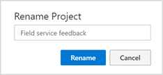
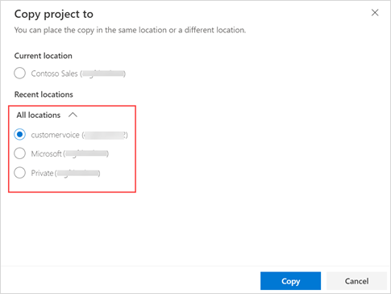
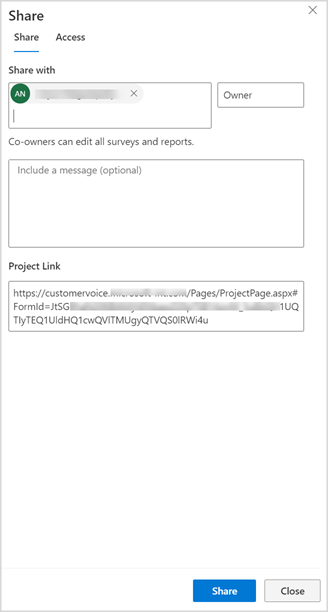

# Manage existing projects
<!--Is there a reason to use "existing" in the title? Recommend deleting it. You have "Create a project" and "manage a project"; there's no management you can do before the project exists.-->
After<!--Via Writing Style Guide--> you've created the projects you need<!--note from editor: In several instances I've replaced "required" with a more user-focused phrase. These are suggested, "just sounds better" edits. "Required" is perfectly fine, but it's rather formal and it implies that the necessity comes from some outside authority.-->, they're available on the **All projects** tab. The following information is displayed:

- **Name**: The name of the project.
- **Modified date**: The date on which the project was modified.
- **Surveys**: The number of surveys created in the project.
- **Responses**: The total number of responses received across all surveys in the project.
- **Environment**: The environment in which the project was created.

You can perform the following actions:

- **Rename**: Rename your project.
- **Copy**: Create a copy of your project in the same or different environment.
- **Share**: Share your project with other people for collaboration.
- **Delete**: Delete a project that you don't need anymore.

## Rename a project

1. Sign in to Dynamics 365 Customer Voice.

2. On the **All projects** tab, hover over the project you want to rename<!--note from editor: Similar to the edits to "required," these suggested edits are meant to make the text more user-directed and less formal.-->, select the ellipsis button , and then select **Rename**.

3. In the **Rename Project** dialog box, enter a new name, and then select **Rename**.

    

## Copy a project

You can create a copy of your project in the same environment or a different environment. Dynamics 365 Customer Voice gives the new project the same name as the existing project and appends `- copy` to it. You can rename the project if you want.

**What's copied to the new project?**

- **Surveys**: Surveys, along with their customizations, are copied as a new instance to the new project.
- **Satisfaction metrics**: All satisfaction metrics that were configured for their respective questions<!--Suggested.--> are copied to the new project. The satisfaction metrics retain their mappings with the questions in the newly created surveys.<!--Suggested, to reduce redundancy.--> 
- **Power Automate flows**: All the Power Automate flows configured for the project are copied to the new project.
- **Email templates**: All<!--Edit okay? To be parallel.--> email templates configured for the surveys are copied to the new project.

**What isn't copied to the new project?**

Survey response data and satisfaction metrics data aren't copied to the new project.

**To copy a project**

1. Sign in to Dynamics 365 Customer Voice.

2. On the **All projects** tab, hover over the project you want to copy, select <!--Via Writing Style Guide, once you define the ellipsis button you just use the graphic by itself. This is something I'd forgotten.-->, and then select **Copy**.

    The **Copy project to** screen is displayed.

3. Do one of the following:<!--Since this is a fork in the procedure, you don't want sequential numbers for the next two steps.-->

   - To copy your project in the same environment you're currently working in, select the environment listed in the **Current location** section.<!--Or "...select the environment listed under **Current location**." -->

      

   - To copy your project to a different environment, expand **All locations**, and then select an environment.

      

5. After selecting an environment, select **Copy**. A notification is displayed in the upper-right corner when the project is copied to the selected location.

## Share a project

You can share your project with multiple people in your organization so they can collaborate on the structure and layout of  surveys within the project. The people with whom the project is shared become the co-owners of the shared project. The projects that are shared with you are available on the **All projects** tab. 

**What can a co-owner do?**

A project co-owner has the same level of permissions as the project owner. This means a co-owner can create, edit, update, delete, and share the project. A co-owner can also remove the project owner from a shared project.

**What can't a co-owner do?**

A project co-owner can't delete a survey that was created by another user. The survey can be deleted only by the user who created it. If a co-owner tries to delete a project that contains a survey created by another user, an error is displayed. If a co-owner removes the project owner from a shared project that contains a survey created by the project owner, the project can't be deleted by the co-owner.

**How are the responses shared?**

If a project contains responses, only those responses that are received after the project was shared will be shared with co-owners.

**To share a project**

1. Sign in to Dynamics 365 Customer Voice.

2. On the **All projects** tab, hover over the project you want to share, select , and then select **Share**.

3. In the **Share** panel, on the **Share** tab, <!--Please see the note about "browse" in create-survey.md.-->select the name of the user from the **Share with** list. You can select multiple users.

    

   (Optional: Include a message to send the co-owners.)<!--Suggest restructuring so the optional step isn't in sequence with the required steps. -->

4. Select **Share**. 

    The co-owners are displayed on the **Access** tab.

    

**To remove a co-owner from a project**

1. Sign in to Dynamics 365 Customer Voice.

2. On the **All projects** tab, hover over the project from which you want to remove a co-owner, select , and then select **Share**.

3. In the **Share** panel, go to the **Access** tab, and then select **Remove access** for the user you want to remove.

    

## Delete a project

You can delete a project that you don't need anymore. Deleting a project removes its surveys, satisfaction metrics, email templates, survey response data, and satisfaction metrics data. The Power Automate flows associated with the surveys are deactivated. The deletion of a project is permanent and can't be reverted.<!--Maybe this should be an Important note?-->

**To delete a project**

1. Sign in to Dynamics 365 Customer Voice.

2. On the **All projects** tab, hover over the project you want to delete, select , and then select **Delete**.

3. In the confirmation dialog box, select **Delete**.
