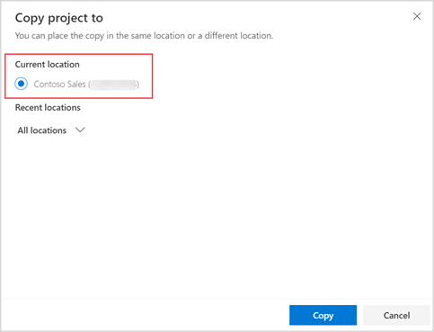
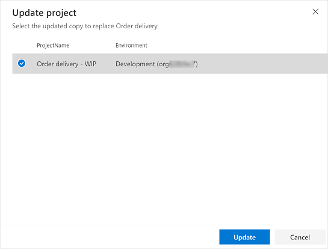

# Manage projects

After you've created the projects you need, they're available on the **All projects** tab. The following information is displayed:

- **Name**: The name of the project.
- **Modified date**: The date on which the project was modified.
- **Surveys**: The number of surveys in the project.
- **Responses**: The total number of responses received across all surveys in the project.
- **Environment**: The environment in which the project was created.

You can perform the following actions:

- **Rename**: Rename your project title.
- **Copy**: Create a copy of your project in the same or different environment.
- **Share**: Share your project with other people for collaboration.
- **Update**: Update your project with a copy of the same project.
- **Delete**: Delete a project that you don't need anymore.

## Rename a project

1. Sign in to [Dynamics 365 Customer Voice](https://customervoice.microsoft.com/).

2. On the **All projects** tab, hover over the project you want to rename, select vertical ellipsis , and then select **Rename**.

3. In the **Rename Project** dialog box, enter a new name, and then select **Rename**.

    

## Copy a project

You can create a copy of your project in the same environment or a different environment. Dynamics 365 Customer Voice gives the new project the same name as the existing project and appends `- copy` to it. You can rename the project if you want.

**What's copied to the new project?**

- **Surveys**: Surveys, along with their customizations, are copied as a new instance to the new project.
- **Satisfaction metrics**: All satisfaction metrics that were configured for their respective questions are copied to the new project. The satisfaction metrics retain their mappings with the questions in the newly created surveys. 
- **Power Automate flows**: All the Power Automate flows configured for the project are copied to the new project.
- **Email templates**: All email templates configured for the surveys are copied to the new project.

**What isn't copied to the new project?**

Survey response data and satisfaction metrics data aren't copied to the new project.

**To copy a project**

1. Sign in to [Dynamics 365 Customer Voice](https://customervoice.microsoft.com/).

2. On the **All projects** tab, hover over the project you want to copy, select , and then select **Copy**.

    The **Copy project to** screen is displayed.

3. Do one of the following:

   - To copy your project in the same environment you're currently working in, select the environment listed under **Current location**.

      

   - To copy your project to a different environment, expand **All locations**, and then select an environment.

      

5. After selecting an environment, select **Copy**. A notification is displayed in the upper-right corner when the project is copied to the selected location.

## Share a project

You can share your project with multiple people in your organization so they can collaborate on the structure and layout of  surveys within the project. The people with whom the project is shared become the co-owners of the shared project. The projects that are shared with you are available on the **All projects** tab. 

When you share a project, a [Microsoft 365 group](/azure/active-directory/fundamentals/active-directory-groups-create-azure-portal) is created in Azure Active Directory and the project co-owners are added as members of the group. When you remove a co-owner from the project, the co-owner is removed from the Azure Active Directory group. When you remove all co-owners from the project, the group is retained with you as its only member. When a Microsoft 365 group is created, a Microsoft Dataverse team (of type [Azure Active Directory group](/power-platform/admin/manage-teams#about-group-teams)) is created. The Dataverse team is assigned the ownership of the project and survey data.

**What can a co-owner do?**

A project co-owner has the same level of permissions as the project owner. This means a co-owner can create, edit, update, delete, and share the project.

**What can't a co-owner do?**

- A co-owner cannot remove the project creator from a shared project.

- A co-owner can't delete a survey that was created by another user. The survey can be deleted only by the user who created it. If a co-owner tries to delete a project that contains a survey created by another user, an error is displayed.

- A co-owner can't move a survey that was created by another user. The survey can be moved only by the user who created it. If a co-owner tries to move a survey that is created by another user, an error is displayed.

**How are the responses shared?**

If a project contains responses, a co-owner can see all responses under **Reports** in the left pane. In the Customer Voice survey responses entity, only those responses that are received after the project was shared will be shared with co-owners. Projects and surveys are owned by the Microsoft Dataverse team (of type [Azure Active Directory group](/power-platform/admin/manage-teams#about-group-teams)). Only those responses that are received after the project is shared will be owned by the Dataverse team. Old responses will continue to be owned by the project owner.

**To share a project**

1. Sign in to [Dynamics 365 Customer Voice](https://customervoice.microsoft.com/).

2. On the **All projects** tab, hover over the project you want to share, select , and then select **Share**.

3. In the **Share** panel, on the **Share** tab, select the name of the user from the **Share with** list. You can select multiple users.

    

   (Optional: Include a message to send the co-owners.)

4. Select **Share**. 

    The co-owners are displayed on the **Access** tab.

    

**To remove a co-owner from a project**

1. Sign in to [Dynamics 365 Customer Voice](https://customervoice.microsoft.com/).

2. On the **All projects** tab, hover over the project from which you want to remove a co-owner, select , and then select **Share**.

3. In the **Share** panel, go to the **Access** tab, and then select **Remove access** for the user you want to remove.

    

### Ownership of survey data

When a project is created, the project creator is the owner of the project and survey data (responses and invitations). When a project is shared, the owner of the project and survey data (responses and invitations) is the Microsoft Dataverse team  (of type [Azure Active Directory group](/power-platform/admin/manage-teams#about-group-teams)). The Dataverse team will be assigned the Project Owner security role and will be an owner team. More information: [Use access teams and owner teams to collaborate and share information](/dynamics365/customerengagement/on-premises/developer/use-access-teams-owner-teams-collaborate-share-information)

Only those responses and invitations that are received and created after the project was shared will be owned by the Dataverse team.

The following table shows the ownership of data in Dynamics 365 Customer Voice entities:

|Entity|User owned projects|Shared projects|
|------------|----------|------------------|
|Customer Voice project|Project creator|Team (Dataverse)|
|Customer Voice satisfaction metric|Project creator|Team (Dataverse)|
|Customer Voice localized survey email template|Project creator|Team (Dataverse)|
|Customer Voice survey|Project creator|Team (Dataverse)|
|Customer Voice survey email template|Project creator|Team (Dataverse)|
|Customer Voice survey question|Project creator|Team (Dataverse)|
|Customer Voice survey question response|Project creator|Team (Dataverse)|
||||

## Update a project

You can update your project with the copy of the same project. The copy can reside in the same environment or a different one. By updating a copy of the project, you can make incremental changes while its survey is being sent to respondents and receiving responses, without interrupting the survey.

> [!NOTE]
> A project can be updated only from a copy of itself, and not from any other project.

The following components can be updated:

- Project
    - Name
    - Satisfaction metrics
- Survey
    - Title
    - Description
    - Name
    - Questions and their corresponding answer options
    - Survey customizations
    - Survey distribution settings
    - Email templates and their corresponding languages

Let's understand the update operation with the following example. 

You work in a company named Contoso, and create and finalize surveys across the following environments: 

- **Development**: The environment where you create and test surveys.

- **Production**: The environment for live surveys, where you move finalized surveys and then share them with respondents.

You've moved a customer satisfaction survey to the production environment, and want to make the following changes to it:

- Add a question
- Change the color theme
- Add a background image

As a company policy, you can't edit surveys directly in the production environment. Therefore, you create a copy of the survey in the development environment and make the required changes. You now update the survey in the production environment by using the copy that you created and updated in the development environment.

> [!NOTE]
> If a survey is available only in the target environment, but not in the source environment, the survey in the target environment will be deleted when you perform the update action. For example, if the source project has two surveys (S1 and S2) and the target project has three surveys (S1, S2, and S3), S3 will be deleted when you update the target project.

**To update the project**

1. Sign in to [Dynamics 365 Customer Voice](https://customervoice.microsoft.com/).

2. On the **All projects** tab, hover over the project you want to update, select , and then select **Update**.

    

3. On the **Update project** screen, select the project from which your project needs to be updated.

    

4. In the confirmation dialog box, select **Confirm**.

A notification is displayed in the upper-right corner when the project is updated.

## Delete a project

You can delete a project that you don't need anymore. Deleting a project removes its surveys, satisfaction metrics, email templates, survey response data, and satisfaction metrics data. The Power Automate flows associated with the surveys are deactivated. The Microsoft 365 group, created while sharing a project, is also deleted from Azure Active Directory. The deletion of a project is permanent and can't be reverted.

**To delete a project**

1. Sign in to [Dynamics 365 Customer Voice](https://customervoice.microsoft.com/).

2. On the **All projects** tab, hover over the project you want to delete, select , and then select **Delete**.

3. In the confirmation dialog box, select **Delete**.

### See also

[Create a project](create-project.md) 
[Create a survey](create-survey.md)  
[Manage surveys](manage-surveys.md)

[!INCLUDE[footer-include](includes/footer-banner.md)]
