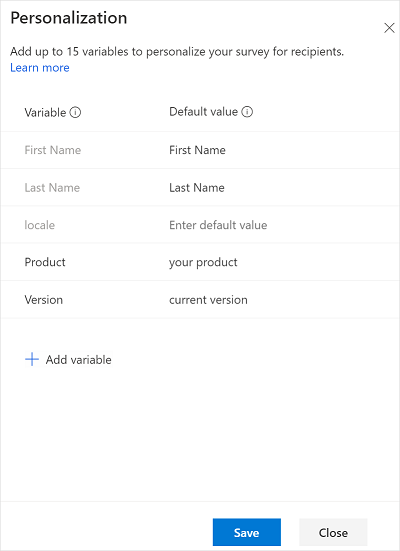

# Personalize a survey by using variables

Variables allow you to personalize a survey by automatically inserting custom information in it. For example, you can use a variable to automatically insert a customer's first name and product name into a question to personalize it. If you plan to send a survey through Power Automate, you can further personalize your survey by adding variables that will be replaced dynamically when a survey is sent through a Power Automate flow.

By default, the following variables are available:

- **First Name**: Inserts the first name of the recipient.

- **Last Name**: Inserts the last name of the recipient.

- **locale**: Specifies the locale of the survey while embedding it in the email. More information: [Embed a survey in an email](send-survey-email.md#embed-a-survey-in-an-email)

**To create a new variable**

1. Open the survey.

2. On the **Design** tab, select **Customization** at the right side of the page, and then select **Variables**.

    

3. In the **Variables** panel, select **Add variable**.

4. Enter a name and default value for the variable.

    

5. To add more variables, repeat steps 3 and 4.

5. Select **Save**.

> [!NOTE]
> - A variable name can contain a maximum of 30 characters consisting of only English letters and numbers.
> - After you create a variable, you'll not be able to rename it.
> - You can also personalize survey invitations by using variables. More information: [Personalize an email](send-survey-email.md#personalize-an-email)
> - Don't use variables if you plan to send a survey anonymously. The variables won't be replaced with actual data in an anonymous survey.
> - Variables are replaced with the specified default values when sending a survey invitation.
> - You can define a maximum of 15 variables in a survey.

## Add variables in a survey

After you've created the required variables, you can add them in the following survey elements:

- Survey description
- Question text
- Question subtitle
- Section heading
- Section description

You can also use variables in [branching rules](create-branching-rule.md), in survey invitations sent through email, and while embedding a survey in a webpage.

> [!NOTE]
> For Likert questions, you must enter the variable name manually.

**To add variables in survey elements**

1. Open the survey.

2. On the **Design** tab, select the survey element where you want to add a variable. The formatting toolbar appears.

3. Place the cursor at the location where you want to add the variable.

4. From the **Variables** list in the formatting toolbar, select the variable you want to add.

    

    The variable is added within curly braces.

For example, let's say that you've created a variable named **Product** and that you want to display the customer's first name and the product name in a question. Select **First Name** and **Product** from the **Variables** list. *{{First Name}}* and *{{Product Name}}* are inserted at the cursor location.

Let's say the question is:
*{{First Name}}*, overall, how would you rate your experience with customer service for *{{Product Name}}*?

That question will look like this when a customer named Bert Hair takes the survey for a product named Contoso Sales:

&nbsp;&nbsp;&nbsp;&nbsp;Bert, overall, how would you rate your experience with customer service for Contoso Sales?

## Specify values for variables

You must specify default values for variables while you create them. If you don't specify default values, nothing will be displayed for the variables. You can also specify the values for variables:

- When sending email invitations.
- When configuring a flow.

### Specify values when sending email invitations

You can specify default values for the variables by opening the **Customization** pane from the right-side of the page, and selecting **Survey variables**. In the **Variables** panel, specify the default values for the required variables.

### Specify values in a flow

To specify values for variables in a flow:

1. While configuring a flow, select **Edit in advanced mode**.

2. Go to the step that sends the survey, and expand it.

3. Select **Show advanced options**.

4. Specify the values for variables.

5. Save the changes.

### See also

[Create a new survey](create-new-survey.md) 
[Preview and test a survey](preview-test-survey.md) 
[Create a branching rule](create-branching-rule.md) 
[Format text in a survey](survey-text-format.md) 
[Create a multilingual survey](create-multilingual-survey.md) 
[Create a multiple-page survey](create-multipage-survey.md)
