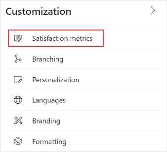
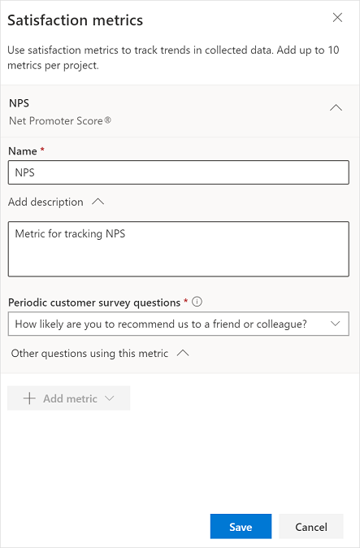

# Add and configure satisfaction metrics

Organizations use various metrics to determine the effectiveness of the experiences they provide to their customers. A subset of these metrics is tracked by them daily and forms the basis for measuring their performance. These metrics are called satisfaction metrics. In other words, we can say that satisfaction metrics are measurement systems that allow you to measure your customer experience. This ensures that the data you collected through survey responses can be analyzed successfully, and decisions can be made accordingly.

Customer Voice includes support for adding the following standardized satisfaction metrics and mapping them to survey questions:

- **Net Promoter Score® (NPS)**: Net Promoter Score is a metric used to measure customer loyalty. The score is calculated from the NPS-type question using a 0-10 scale. The respondents are grouped based on the scores as follows:
  - **Detractors** are those who respond with a score of 0 to 6.
  - **Passives** are those who respond with a score of 7 to 8.
  - **Promoters** are those who respond with a score of 9 to 10.

  NPS is calculated by subtracting the percentage of detractors from the percentage of promoters. The score is a number that can range from -100 to 100.

- **Sentiment**: Sentiment is a metric used to identify the sentiment of customers towards a product or a service. Sentiment groups the responses as positive, negative, and neutral based on their response to a text-based question.

- **Customer Satisfaction (CSAT)**: Customer Satisfaction is a metric used to measure the satisfaction level of customers with a product or a service. CSAT is measured by responses to the rating-type questions.  

Satisfaction metrics are defined at the project level. If you create a project from one of the ready-to-use project templates, satisfaction metrics are already created and mapped with the questions. But, you can add more metrics as per your requirement. If you create a project from the **Blank** project template, you need to add satisfaction metrics and map them with the questions.

After you have received responses to your survey, a dashboard is created automatically for each set of metrics showcasing recent scores and trends. The dashboard is available under the **Reports** tab in the left-navigation pane.

## Add satisfaction metrics

1. Open the survey in which you want to add satisfaction metrics.

2. On the **Design** tab, select **Customization** at the right-side of the page, and then select **Satisfaction metrics**.

    

3. In the **Satisfaction metrics** panel, select **Add metrics**, and the select the type of metric to be added.

    

4. Enter the following information:

    - **Name**: Name of the satisfaction metric.

    - **Add description**: Expand the section and add an optional description for the satisfaction metric.

    - **<survey_name> question**: Choose a question to be mapped with the satisfaction metric.

      

5. To see questions from other surveys within the project mapped with the metric, expand the **Other questions using this metric** section.

6. Select **Save**.

7. To add more metrics, repeat steps 3 through 6.

## Edit satisfaction metrics

After you have created the required satisfaction metrics, you can edit their details or delete the ones that are not required.

1. Open the survey in which you want to manage satisfaction metrics.

2. On the **Design** tab, select **Customization** at the right-side of the page, and then select **Satisfaction metrics**.

  Satisfaction metrics are displayed in the **Satisfaction metrics** panel.

3. To edit a metric, expand it, and update the name and description as required. If you change the question that is mapped with the metric, a confirmation message is displayed. Select **Change** in the confirmation message to continue.

4. Select **Save**.

5. To delete a metric, hover over the metric, and select **Delete**.

6. In the confirmation message, select **Delete** to continue with the deletion.