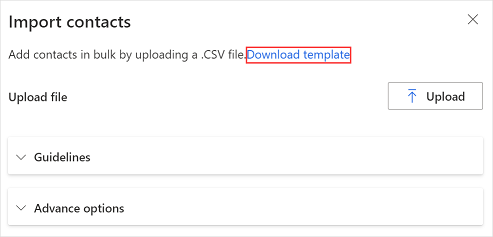
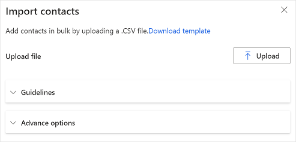
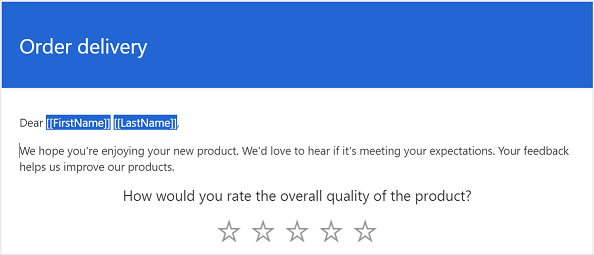

# Send a survey by using email

Customer Voice provides an easy way to send your survey to multiple people through email. By using the built-in email composer, you can send customized email invitations to your recipients and track their status on a dashboard.

**To send a survey through email**

1.  Open the survey and go to the **Send** tab.

2. Select **Email**. A default subject line and email message appear, along with a link to your survey in the message body. You can modify and format the text to meet your requirements.

3.  In the **Recipients** field, enter the recipient's name or email address. You can populate the **Recipients** field by using any of the following methods:

    - Entering an email address manually.
    - Entering a name, email address, or a distribution list from Azure Active Directory.
    - Entering a contact or contact list/view from Common Data Service. The contacts are populated from the environment in which your project is created. <!-- Shubham  More information: [Work with environments](choose-environment.md) -->
    - Uploading a CSV file by selecting **Upload contacts**. More information: [Upload contacts from a CSV file](#import-recipients)

4.  To insert the survey link into your email message, see [Insert a survey link](#insert-survey-link).  

5.  To add an unsubscribe link to your email message, see [Insert an unsubscribe link](#unsubscribe-from-a-survey).  

6.  To personalize the email by using survey variables, see [Personalize the survey email](#personalize-an-email).

7. To embed the first question of the survey into your email message, see [Embed a survey in an email](#embed-survey-in-an-email).

8.  To select an email template, select a template from the **Template** list. More information: [Use email templates](#use-email-templates)

9.  To customize the **From** address of the email, see [Customize the sender's email address](#customize-sender-email-address).

10.  When you're ready to send your survey, select **Send**.

> [!NOTE]
> You can send a survey invitation to a maximum of 10,000 recipients.

## Upload contacts from a CSV file

You can upload a maximum of 10,000 contacts by using a CSV file. You can also use this file to associate a survey invitation and response to an entity in Common Data Service. To upload contacts, you must first [create the CSV file](#create-a-csv-file) and then [upload the CSV file](#upload-a-csv-file).

### Create the CSV file

Provide details in the CSV file in the following order: Email address, first name, last name. To associate a survey invitation and response to an entity, you must provide the regarding entity ID and regarding entity name. To quickly get started, you can also download a CSV template.

**To download a CSV template**

1. In the email editor, select **Upload contacts** in the **Recipients** field.

2. In the **Upload contacts** panel, select **Download a template**.

    

After the CSV template is downloaded, enter the required information in the following columns:
- **Email address**: Email address of the recipient.
- **First name**: First name of the recipient.
- **Last name**: Last name of the recipient.

To associate a survey invitation and response to an entity, add the following columns to the CSV file and enter the information:
- **RegardingID**: ID of the entity to associate with the survey invitation and response. 
- **RegardingEntityName**: Name of the entity to associate with the survey invitation and response.

### Upload the CSV file

1. In the email editor, select **Upload contacts** in the **Recipients** field.

2. In the **Upload contacts** panel, select **Upload**.

    

3. Browse to and select the CSV file you want to upload.

## Insert a survey link

The survey link is added to your email message by default. To insert the survey link in a different location in your email message, place the cursor at the location you want, and then select **Insert** > **Survey link**. You can also select text, and then select **Insert** > **Survey link** to display that text as the survey link.

## Insert an unsubscribe link

You can configure your email message to include a link that allows a respondent to unsubscribe from the survey. To insert the unsubscribe link in the email message, place the cursor at the required location, and then select **Insert** > **Unsubscribe link**. You can also select text, and then select **Insert** > **Unsubscribe link** to display that text as the unsubscribe link. By default, the unsubscribe link is added to all email message templates.

## Personalize the survey email

You can use variables to personalize your survey email&mdash;for example, you can add the respondent's first name. Place the cursor where you want the name to appear, select **Personalize**, and then select **First Name** from the list. A placeholder is added at the cursor location. The first name of the respondent is automatically inserted when the email is sent. All variables created in a survey are displayed in the **Personalize** list.

To create a new variable, select **New variable** from the **Personalize** list. If default values haven't been defined for survey variables, nothing is displayed for the variables. For more information about creating variables and providing values for them, see [Personalize a survey](personalize-survey.md).

## Embed a survey in an email

If you have added a Choice (single answer), Rating (star or smiley symbol), or Net Promoter Score question as the first question in your survey, you can embed it in your email message. To embed the question, select **Embed first question**. When you embed a question, the text in the email message is replaced by the question. When a responder selects an option to answer the question, the whole survey is opened in a web browser and the responder can continue with completing the survey.

> [!NOTE]
> - You can't embed a question in an email if you've enabled question shuffling in the survey.
> - If you want to send an embedded survey in an email through Power Automate, you must embed the question in an email and save it as a new email template. While configuring a flow, you must select the new email template. More information: [Use email templates](#use-email-templates)

If you've created a multilingual survey, you can use survey variables to set the default locale for displaying the survey. To set the default locale, open the **Variables** panel, and then specify a value for the **locale** variable. The value must be a language code, for example **en** or **fr**.

## Use email templates

You can use an email template&mdash;a preformatted email message&mdash;to quickly create and send email messages. If you create a survey from blank, **Default Template** is selected for use in an email message. If you've created a project from one of the out-of-the-box templates, the corresponding email template is selected by default.

### Create a new email template

You can create a new email template as per your requirement.

### Import an email template

> [!NOTE]
> - You can save a maximum of 10 email templates.
> - If an email template includes survey variables that aren't part of the survey, an error message is displayed at the top of the page and you won't be allowed to send the survey through email or Microsoft Power Automate. The survey variables will be highlighted in red; you must remove these highlighted variables from the email message before you can send the survey.

## Add language to email

## Customize the sender's email address

By default, surveys are sent from the `surveys@email.formspro.microsoft.com` email address. The email customization feature helps you select an email address consisting of your company's domain. You can use the custom email address to send survey invitations to your respondents. 

Let's say you are an owner of a company named Contoso Suites. The company's website is `www.contososuites.com`. You can create two custom email addresses (for example, `noreply@contososuites.com` and `support@contososuites.com`) consisting of your company's domain.

**To customize the sender's email address**

1. Sign in to the [Power Platform admin center](https://admin.powerplatform.microsoft.com/support) with your admin credentials.

2. Select **Help + support** > **New support request**. The support request form is displayed in the right pane.

3. Specify the product details as follows:

    - **Product**: **Dynamics 365 Customer Engagement**
    - **Problem type**: **Forms Pro**
    - **Environment**: Enter or select your Common Data Service environment

4. Select **See solutions**.

5. Select **Create a support request**, and specify details as follows:

    - **Issue title**: Customize the From email address to send survey invitations
    - **Issue description**: Enter your issue description, and provide the domain you want to configure for sending emails. For example, if the website is `www.contososuites.com`, you must provide `contososuites.com` as the domain.
    - **How severe is this issue?**: Select the severity of the issue.

6. Select **Next**.

7. Enter your contact information, and then select **Submit**. A ticket is created with the Microsoft support team, which will contact you with the following DNS records:

    - **Ownership authentication key**: Proves that your organization owns the domain.

    - **Email authentication keys for DKIM**: Prove that Forms Pro is authorized to send messages that show your organization's domain name in the from-address.

8.	After record creation, contact Microsoft support, and provide the following information:

    - A list of email addresses you want to create, such as  noreply@contososuites.com and support@contososuites.com.
    - A list of users who will be sending the survey invitations by using the custom email.

    Based on the information provided, Microsoft support will then verify the records and create the DKIM keys for signing the emails. You'll get a confirmation from Microsoft support that the record verification is complete.

    > [!NOTE]
    > The SLA for creating DKIM keys is minimum 3 to 4 days.

10.	Sign in to Forms Pro, and open the **Settings** pane. Select the custom email address that you want to use for sending email.  

    
    

    Use the custom email while sending the survey invitation.

    
    

    > [!NOTE]
    > In Power Automate, the custom email address is picked from the survey settings.

### Example DNS records

#### TXT record

`TXT name: @`
`TXT value: msfpkey=abc123abc123abc123abc123`

#### CNAME record

`Host name or Alias: fpeurkey1.\_domainkey`
`Points to address: fpeurkey1contosocom.d01.formspro.dynamics.com`

### Frequently asked questions

#### Should the email account be a functioning account, or can it be a dummy account?

The email account need not be a functioning account to send emails; however, a mailbox must be configured if the account is expected to receive replies. In most cases, the email address from which survey emails are sent is an unmonitored email account, and need not receive emails.

#### How long does it take for setup to be completed?

It will take a minimum of 3 to 4 days for setup to be completed. After Microsoft support confirms the domain is active, you can start sending survey invitations by using the custom email.

### See also

[Work with survey settings](invite-settings.md) 
[Send a survey by using Power Automate](send-survey-flow.md) 
[Embed a survey in a webpage](embed-web-page.md) 
[Send a survey link to others](send-survey-link.md) 
[Send a survey QR code](send-survey-qrcode.md) 
[Embed a survey in Power Apps](embed-survey-powerapps.md)
