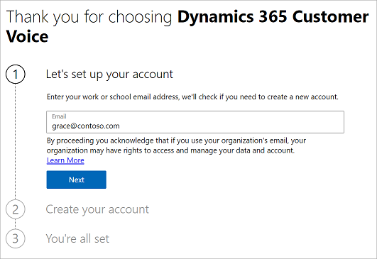
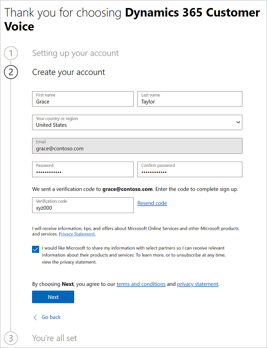
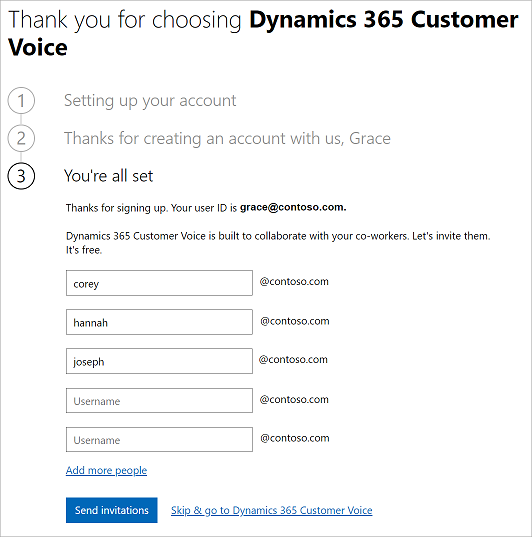

# Sign up for the Dynamics 365 Customer Voice trial

[!INCLUDE[cc-data-platform-banner](includes/cc-data-platform-banner.md)]

You can sign up for a free 30-day trial of Dynamics 365 Customer Voice. After the trial period, you'll need a paid license to continue using Dynamics 365 Customer Voice. For information on purchasing Dynamics 365 Customer Voice licenses, go to [Purchase Dynamics 365 Customer Voice](purchase.md).

> [!NOTE]
> Dynamics 365 Customer Voice isn't available for trial in US Government Community Cloud.

1. Open [https://dynamics.microsoft.com/customer-voice/overview/](https://dynamics.microsoft.com/customer-voice/overview/) in a web browser.

2. Select **Get started**.

3. In the **Let's set up your account** step, enter your email address, and then select **Next**.

   

   > [!NOTE]
   > A work or school account is required for trying Dynamics 365 Customer Voice.

4. Select **Yes**.

   

5. In the **Create your account** step, enter your personal details, create a password, and enter the verification code sent to the email address entered in the **Let's set up your account** step. After entering the details, select **Next**.

   

6. In the **You're all set** step, do one of the following:

   - Enter usernames of your co-workers to send invitations for trying Dynamics 365 Customer Voice, and then select **Send invitations**. The invitations will be sent, and you'll be redirected to the Dynamics 365 Customer Voice home page.
   - Select **Skip & go to Dynamics 365 Customer Voice** to skip sending the invitations and go directly to the Dynamics 365 Customer Voice home page.

   

   > [!NOTE]
   > You can receive a total of 100 survey responses in the trial period.

## Experience for a trial or new user

Dynamics 365 Customer Voice uses a Microsoft Dataverse environment to store and manage data. Provisioning an environment typically takes 15 to 60 minutes to complete. While an environment is getting provisioned, some functionality isn't available, but you can perform minimal operations and explore the product. After the environment is provisioned, all functionality becomes available. More information: [What is Dataverse?](/powerapps/maker/common-data-service/data-platform-intro) and [Environments overview](/power-platform/admin/environments-overview)

This section lists all the functionality that will be restricted until an environment is provisioned. These restrictions apply:

- Only for the default environment.
- Only for the trial users and the users who purchase Dynamics 365 Customer Voice through Microsoft 365 admin center.

**What can you do while an environment is getting provisioned?**

- See a preview of the out-of-the-box project templates.
- Create a project by using the **Blank** project template.
- Create new surveys within a project.
- Preview a survey.
- View reports (as read-only).
- Select links such as content, videos, and blogs on the **Home** tab.

**What can't you do while an environment is getting provisioned?**

- Send your surveys through email or Power Automate.
- Choose or modify email templates.
- Submit responses while previewing a survey.
- Configure satisfaction metrics.
- Perform actions such as copy, delete, or rename projects and surveys.

### See also

[Create a project](create-project.md) 
[Create a survey](create-survey.md) 
[Send a survey](send-survey.md) 
[About reports](about-reports.md)

[!INCLUDE[footer-include](includes/footer-banner.md)]
