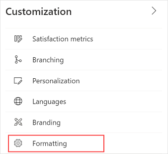
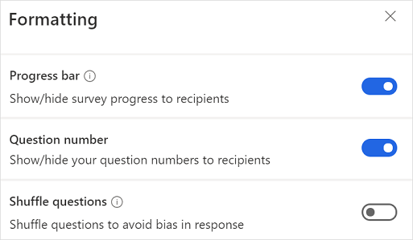
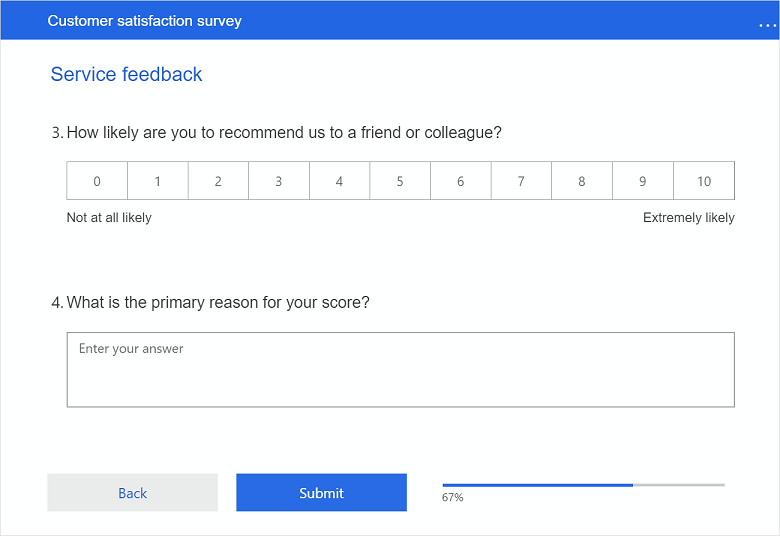

# Add formatting to a survey

Formatting controls the general look and feel of your survey. This includes showing or hiding a progress bar, showing or hiding question numbers, and shuffling questions in a survey. 

**To add formatting to a survey**

1. Open the survey.

2. On the **Design** tab, select **Customization** at the right side of the page, and then select **Formatting**.

    

    The **Formatting** panel is displayed.

    

3. Update the formatting options as described in the following sections.

## Progress bar

A progress bar shows your respondents the percentage of pages that they've navigated to or viewed so far. It gives them an idea of how far they've come and how far they have to go. The progress bar takes into account all pages in the survey. If pages have been skipped due to a branching rule, the progress bar shows the adjusted completion percentage. The progress bar is displayed only if there are two or more pages in the survey.

By default, this setting is turned on for multiple-page surveys and the progress bar is displayed. For a single-page survey, this setting is turned off.

When turned on, the progress bar is displayed to the right side of the buttons on the survey.

## Question number

Specify whether the question numbers should be displayed in a survey. By default, this setting is turned on. If you want to hide question numbers in a survey, turn off this setting.

## Shuffle questions

Specify whether the questions in a survey should be shuffled to avoid bias in responses.<!--Interesting! I don't think this is self-evident, but it sounds intriguing. Does it mean people tend to answer the early questions and often skip the later ones (giving a better rate of return for the early questions)? Or does it mean that one question might influence the respondent to answer the next question in a particular way, so you shuffle the questions to negate this effect? In any case, it probably wouldn't make sense to explain it here, since you're just talking about the mechanics of formatting in this topic, but perhaps it could be described in invite-settings.md?--> By default, this setting is turned off. If you want to enable question shuffling in a survey, turn on this setting. This setting is disabled when a branching rule is created in a survey.<!--SELF: Make this a note? -->
