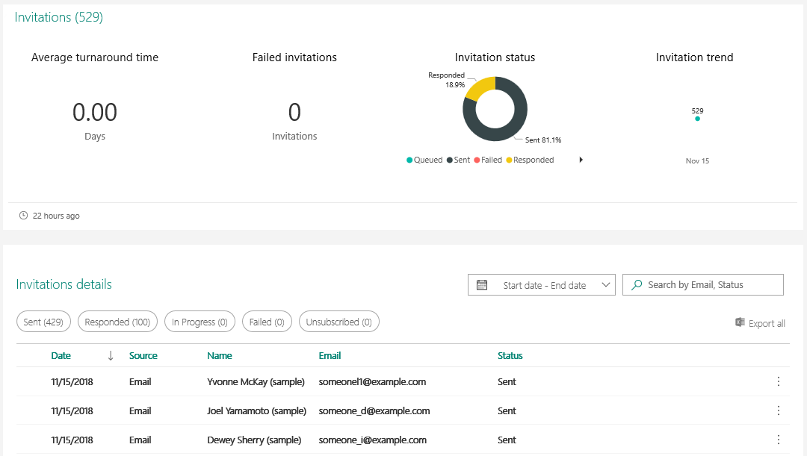

# Analyze survey invitations

A survey invitation record is created for each survey email that's sent, either manually or with Microsoft Power Automate. To see the survey invitations associated with a survey, go to **Responses** &gt; **Overview**, and then select **Invitations** from the summary information.

> [!div class=mx-imgBorder]
> 

The following survey invitation statistics are displayed in a summary pane at the top of the page and the list of survey invitations sent for a survey is displayed below the statistics in the grid format.

- **Average turnaround time**: Average time between sending a survey invitation and receiving a survey response. The unanswered survey invitations are ignored for this.

- **Failed invitations**: Number of failed invitations in the last week.

- **Invitation status**: A pie chart showing the distribution of survey invitations by status. The following statuses are displayed:

  - **Queued**: The survey invitation email is queued to be sent.
  - **Sent**: The survey invitation email has been successfully delivered to the recipient.
  - **Failed**: The survey invitation email wasn't delivered to the recipient due to an incorrect email address or any other error.
  - **Responded**: The recipient has responded to the survey.
  - **Unsubscribed**: The recipient has unsubscribed from receiving the survey-related emails.
  - **Read**: The survey invitation email is read or opened.
  - **Started**: The survey has been started by the recipient but is not completed yet.
  - **Delayed**: There is some delay in delivering the survey invitation email and is being retried.

- **Invitation trend**: A line chart showing the distribution of survey invitation trends.

> [!div class=mx-imgBorder]
> 

## Filter invitations

You can filter the invitations by using the following:

- **Pre-defined filters**: Use the Sent, Responded, In Progress, Failed, and Unsubscribed filters to filter the invitations.

- **Date range**: Select 30 days, 90 days, or a custom date range.

- **Recipient's name or email address**: Enter the recipient's name or email address in the search box.

## Export survey invitations

You can export a single survey invitation or multiple survey invitations to Excel. To export survey invitation(s), select the required invitation(s), and then select **Export** in the **Invitations details** section.

Each invitation property is a column, and each invitation becomes a row in the Excel workbook.

> [!div class=mx-imgBorder]
> 

## Delete survey invitations

You can delete a single survey invitation or multiple survey invitations from Forms, Common Data Service, and the insights store. When a survey invitation is deleted, the associated survey response is also deleted.

To delete survey invitations, select the required invitations, and then select **Delete** in the **Invitations details** section. Select **Delete** in the confirmation message.

> [!div class=mx-imgBorder]
> 

### See also

[View summary information for your survey](view-summary-information.md) 
[View details for each question](view-details-each-question.md) 
[Analyze survey responses](analyze-survey-responses.md) 
[Analyze survey insights](analyze-survey-insights.md)
