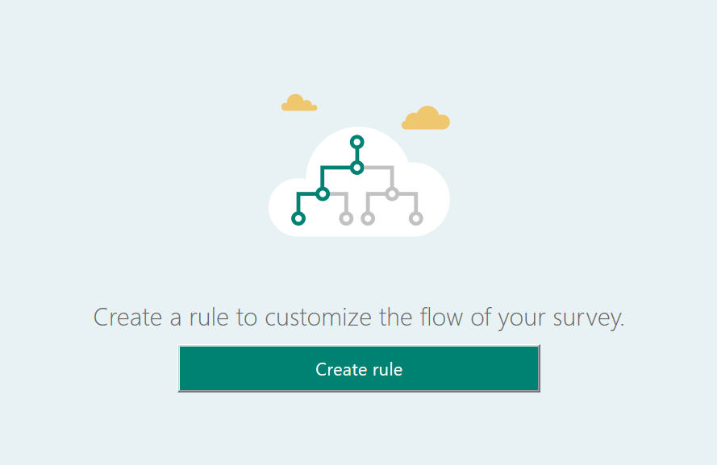
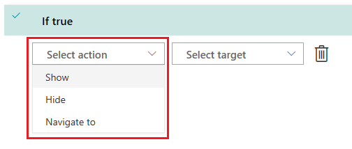
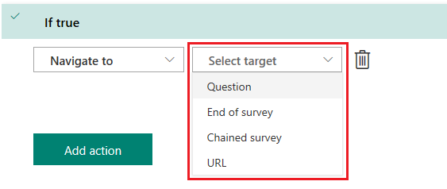

# Create a branching rule

When you want to ask additional questions based on responses in a survey, create one or more branching rules for those responses. Branching rules make your surveys interactive and ensure that only the relevant questions are displayed to the responders. 

You can also choose to navigate to another question or survey, or even open a website based on the response to a question. If you have hidden a question from being displayed in a survey by using the **Visible** option, you can use the branching rule to display it as per the required response. For more information on setting the visibility of a question, see [Create a new survey](create-new-survey.md).

For example, for the question **How likely is it that you would recommend us to a friend?**, you can create a branching rule to ask the reason if someone responds **Not likely**.

To create a branching rule:

1.	Open the survey in which you want to add a branching rule.

2.	On the **Create Questions** tab, select the **ellipsis** button (…) from the toolbar at the top of the page, and then select **Branching rules**. 

    > [!div class=mx-imgBorder]
    > 
    
    If you don't have any rules created yet, the following page is displayed. Select **Create rule**. 

    > [!div class=mx-imgBorder]
    >  

    If you have at least one rule created, a list of rules is displayed in a grid. Select **New rule**. 
 
    > [!div class=mx-imgBorder]
    > 

3.	In the **Rule name** field, enter a name for the branching rule.

4.	In the **Define conditions** area, select **Add condition** to add a response condition.

5.	In the **Select question** list, choose the question for which you want to create a rule.

    > [!div class=mx-imgBorder]
    > 

6.	Select values from the **Select operator** and **Select response** lists accordingly.

    > [!div class=mx-imgBorder]
    > 

    You can add more conditions with the combination of **AND**/**OR** operators by selecting **Add condition**.

    > [!div class=mx-imgBorder]
    > 

7.	Select **Add “If true”** to add the action that will trigger when the defined condition meets the criteria.

8.	Select **Add action** to add the response action.

9.	In the **Select action** list, choose one of the following actions:

    - **Show**: Allows you to select a question to be displayed per the response to a question.
    - **Hide**: Allows you to select a question to be hidden per the response to a question.
    - **Toggle**: Allows you to toggle the state of the selected question per the response to a question.
    - **Navigate to**: Allows you to select a target to which a responder should be navigated.

    > [!div class=mx-imgBorder]
    > 

10.	In the **Select target** list, choose a target for the selected action. If you select **Show**, **Hide,** or **Toggle** as the action, you can select **Question** as the target. If you select **Navigate to** as the action, you can choose one of the following targets:

    - **Question**: Allows you to skip to a question per the response to a question. The questions in between the source and target questions are hidden from the responder.
    - **End of survey**: Allows you to end the survey per the response to a question.
    - **Chain survey**: Allows you to open a different survey, created by you, per the response to a question.
    - **URL**: Allows you to open a website per the response to a question. You must add `http://` to the URL for it to work properly.

    > [!div class=mx-imgBorder]
    > 

11.	In the **Select value** list, enter or choose a value per the target.

    > [!div class=mx-imgBorder]
    > 

12.	Select **Add “If false”** to add the action that will trigger when the defined condition does not meet the criteria. Then follow Steps 8 through 11. 

    > [!div class=mx-imgBorder]
    > 

13. Select **Save**.

After creating a branching rule, you can preview the survey and see if the rule is working as expected.

## Manage branching rules

Once you have created a branching rule or a set of branching rules, you can edit, delete, or change the order of their execution. The branching rules are executed in the order they are created. 

1. Open the survey in which you want to manage branching rules.
 
2. On the **Create Questions** tab, select the ellipsis button (…) from the toolbar at the top of the page, and then select **Branching rules**. 

    > [!div class=mx-imgBorder]
    > 

3. A list of rules is displayed in a grid.

    > [!div class=mx-imgBorder]
    > 

4. To edit a branching rule, select **Edit**  from the corresponding rule row.

5. To delete a branching rule, select **Delete**  from the corresponding rule row.

6. To change the order of execution of a branching rule, move a rule up or down in the grid. To move a rule up or down, select **Move up**  or **Move down**  from the corresponding rule row.

## See also

[Create a new survey](create-new-survey.md) 
[Apply theme to a survey](apply-theme.md) 
[Preview and test a survey](preview-test-survey.md) 
[Personalize a survey](personalize-survey.md) 
[Format text in a survey](survey-text-format.md) 
[Create a classic form](create-classic-form.md) 
[Create a multilingual survey](create-multilingual-survey.md) 
[Create a multipage survey](create-multipage-survey.md)
