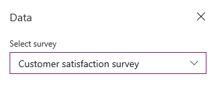
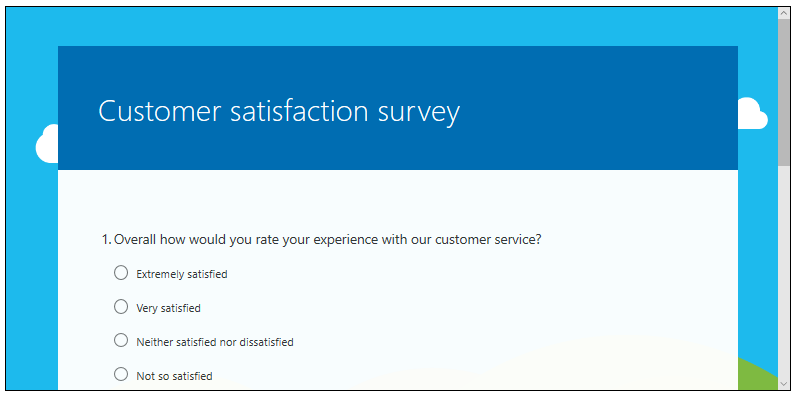

# Embed a survey in PowerApps

[!include[cc-beta-prerelease-disclaimer](includes/cc-beta-prerelease-disclaimer.md)]

You can embed your surveys in the canvas apps created using PowerApps. This allows users to respond to the surveys directly from the apps.

1.	Sign in to [PowerApps](https://web.powerapps.com/).

2.	Create a blank canvas app or use one of the available templates. For more information on creating a canvas app, see [Create a canvas app from scratch using Common Data Service](https://docs.microsoft.com/en-us/powerapps/maker/canvas-apps/data-platform-create-app-scratch).

3.	On the **Insert** tab, open the **Controls** menu and then add the **Forms Pro survey (Preview)** control.

    > [!div class=mx-imgBorder]
    >  control")  

4.	In the options pane, select **No data**.

    > [!div class=mx-imgBorder]
    >   

5.	In the **Data** pane, select a survey from the **Select survey** list.

    > [!div class=mx-imgBorder]
    >  

    The selected survey is rendered in the control.

    > [!div class=mx-imgBorder]
    >  

6.	To define context parameters, go to the **Advanced** tab in the options pane.

7.	In the **ContextParameters** field, enter context parameters as comma-separated key/value pairs. For example, `{Name:TextInput1.Text, Region:Dropdown1.SelectedText}`.

    > [!div class=mx-imgBorder]
    >   
