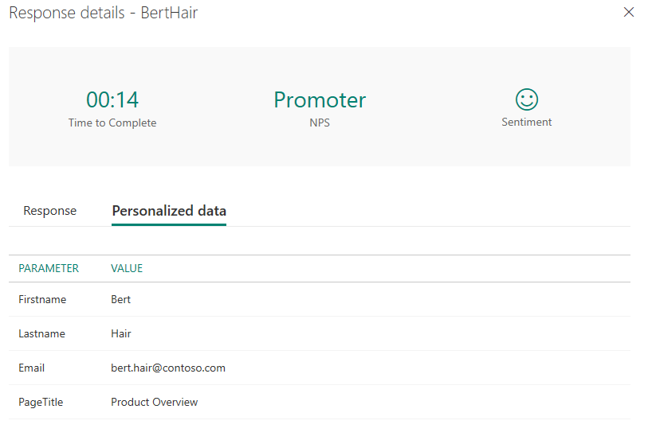

# Embed a survey in a webpage

> [!NOTE]
> Microsoft Forms Pro has evolved into Dynamics 365 Customer Voice, providing you with additional survey capabilities and business benefits. The change is being introduced in phases and will be available in all geographical regions in the next few weeks, except for US Government Community Cloud customers. Dynamics 365 Customer Voice will be available on US Government Community Cloud by October 2020. For more information, see the [Dynamics 365 Customer Voice](https://go.microsoft.com/fwlink/p/?linkid=2128357) documentation.

You can embed your survey in a webpage by pasting the survey's embed code into your webpage's source code. You can choose one of the following embed styles for your survey:

- **Inline**: Displays the survey statically on the webpage.

- **Pop-up**: Displays the survey in a pop-up window based on the respondent's action.

- **Button**: Displays the survey when a button is selected. By default, the button name is **Provide feedback**.

You can also select a display density for your survey. The display density controls the amount of white space and the size of the elements on the screen. The following options are available for display density:

- **Standard**: Displays the survey with the standard amount of white space and standard-size elements on the screen.

- **Compact**: Displays the survey with a reduced amount of white space and smaller elements on the screen. By default, **Compact** is selected. This display density is useful for displaying the survey on smaller screens, such as mobile devices or tablets.

If you've created survey variables, they'll be used to capture your respondent's information and the context in which the response was provided, and store that data in the survey response. You can also create new survey variables, if you need. If the appropriate values aren't passed to survey variables in the embed code, the default values will be used.

The values of survey variables in a response are displayed on the **Personalized data** tab.

> [!div class=mx-imgBorder]
> 

To embed your survey:

1.  Open the survey you want to embed, and then select **Send** from the toolbar at the top of the page.

2.  Select **Embed**.

3. Under **Select display density**, select one of the following options:

    - Standard

    - Compact

4.  Under **Set embed style**, select one of the following options:

    -   Inline

    -   Pop-up

    -   Button

5.  Optionally, under **Survey variables**, select **New variable** to create a new variable.

6.  Select **Generate code**. The embed code is generated in accordance with the options you selected.

7.  Select **Copy**, and then paste the embed code into a webpage to embed your survey. You must then update the webpage's source code to render the survey on the webpage. For information about how to update the source code, see [Update a webpage's source code](#update-a-webpages-source-code).  

    > [!div class=mx-imgBorder]
    >   

## Update a webpage's source code

After generating the embed code, you must add it to your webpage's source code and create a method that calls the **renderSurvey** function to render the survey on the webpage. You must ensure that the values in the **renderSurvey** function are passed in the same order as the survey variables that are defined in the **renderSurvey** function in the embed code.

For an inline survey, a parent `div` container with the ID `surveyDiv` must be defined for the survey to be displayed. The minimum width and height of the parent `div` container must be 350 pixels and 480 pixels respectively.

### Scenario to embed an inline survey

Let's say you've created a survey with two additional survey variables (**Email** and **PageTitle**). You want to embed the survey as inline into your webpage and load the survey as soon as the page loads. The embed code is generated as follows:

```JavaScript
<script src="https://www.contoso.com/Embed.js" type="text/javascript"></script><link rel="stylesheet" type="text/css" href="https://www.contoso.com/Embed.css" />
<script type = "text/javascript" >function renderSurvey(parentElementId, FirstName, LastName, Email, PageTitle)
{var se = new SurveyEmbed("JtSG9ha000000000020pTSB1AovM_5u8bQH1UQjlNQjZRWV0000000000","https://www.contoso.com/");
var context = {"FirstName": FirstName,"LastName": LastName,"Email": Email,"PageTitle": PageTitle,};
se.renderInline(parentElementId, context);}</script>
```

In the preceding embed code, the `renderSurvey` function contains the `parentElementId` parameter in addition to the survey variables. The `parentElementId` parameter receives the `div` container ID when it's called.

You must create a `div` container with the ID `surveyDiv` on the webpage where you want to display the survey. This `div` container displays the survey statically in a designated area on the webpage. Because you'll want to load the survey when the page loads, create a method as follows:

```JavaScript
<script>
	 window.addEventListener('load', function () {
            renderSurvey("surveyDiv", "Bert", "Hair", "bert.hair@contoso.com", "Product Overview");
        }, false);
</script>
```

The preceding method calls the `renderSurvey` function and passes the required values accordingly. In this method, static user details are passed, but you can provide a function that retrieves the logged-in user details.

> [!NOTE]
> The above code snippets are provided as an example. You must generate the actual embed code from Forms Pro and create methods as per your requirements.

### See also

[Work with survey settings](invite-settings.md)<br>
[Send a survey by using email](send-survey-email.md)<br>
[Send a survey by using Power Automate](send-survey-flow.md)<br>
[Send a survey link to others](send-survey-link.md)<br>
[Send a survey QR code](send-survey-qrcode.md)<br>
[Embed a survey in Power Apps](embed-survey-powerapps.md)
