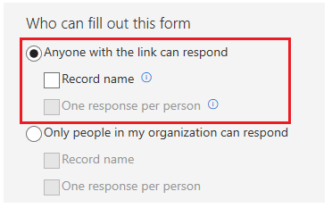
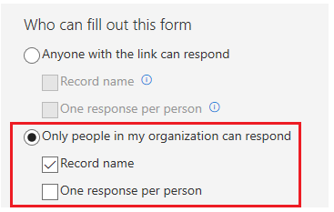

# Define who can respond to a survey 

[!include[cc-beta-prerelease-disclaimer](includes/cc-beta-prerelease-disclaimer.md)]

You can create two types of surveys:

-   External surveys to get responses from customers on things like case resolutions or order closures.

-   Internal surveys to get responses about internal organization events such as an outing.

For external surveys:

1. Select **Settings**  from the upper-right corner of the page.
2. Select **Anyone with the link can respond**. When you select this option, respondents are not required to sign in with their credentials.
3. Optionally, you can select one or both the following options:
    - **Record name**: Respondent's name is recorded. This option works only if a [personalized survey link](#work-with-personalized-links) is generated.
    - **One response per person**: A respondent can submit only one response. This option is enabled only when **Record name** is selected and works only if a [personalized survey link](#work-with-personalized-links) is generated.

    

For internal surveys:

1. Select **Settings**  from the upper-right corner of the page.
2. Select **Only people in my organization can respond**. When you select this option, respondents are required to sign in with their credentials. 
3. Optionally, you can select one or both the following options:
    - **Record name**: Respondent's name is recorded.
    - **One response per person**: A respondent can submit only one response.

    

When you've defined who can respond to your survey, you can select the following options:

- **Accept responses**: Specify whether the survey is open and accepting responses. By default, this option is selected. If you want to stop your survey, clear the option, and specify a message for the recipients.
- **Start date**: Specify a date when the survey will be open. 
- **End date**: Specify a date when the survey will be closed.
- **Shuffle questions**: Specify whether the questions in the survey should be shuffled.
- **Email notification of each response**: Specify whether email notification is required when a response is submitted.

    

> [!NOTE]
> - Currently for this preview, you can't change the settings for **Anyone with the link can respond.** It is always set to **Record name**, which records respondents names.
> - You can modify the authentication settings at any time, even after distributing the survey by email or other channels.
> - Anyone with the link address is able to see and complete your survey. Be sure you're comfortable sharing the contents before changing this default option.

## Work with personalized links

The personalized survey links are generated when a survey is sent by using the built-in email composer and Microsoft Flow. The survey links are unique to its recipients and help to record the respondent's name and/or whether the respondent must submit only one response.

When you send a survey by generating a link or a QR code, the survey links that are generated are not personalized. In this case, you will not be able to record the respondent's name and whether the respondent has submitted only one response.

