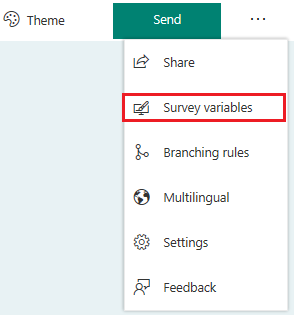

# Personalize a survey

With placeholders, automatically insert customer information into your survey by using survey variables. For example, you can use a survey variable to automatically insert a customer's first name into a question to personalize it.

By default, the following survey variables are available:

- **First Name**: Inserts first name of the recipient.

- **Last Name**: Inserts last name of the recipient.

To create a new survey variable:

1.	Open the survey in which you want to use survey variables.

2.	On the **Create Questions** tab, select the ellipsis button (…) from the toolbar at the top of the page, and then select **Survey variables**.

    > [!div class=mx-imgBorder]
    > 

3.	Select **New variable**.

5.	Enter a name and default value for the survey variable.

> [!NOTE]
> - You can also personalize survey invitations by using survey variables. More information: [Personalize an email](send-survey-email.md#personalize-an-email).
> - Don't use survey variables if you plan to send a survey anonymously. Placeholders will not be replaced with actual data in an anonymous survey.
> - Survey variable placeholders are replaced with the specified default values when sending a survey invitation.
> - You can define a maximum of 15 variables in a survey.

## Add survey variables to a question

After creating the required survey variables, you need to add their placeholders in the question. To add survey variable placeholders to a question:

1.	Open the survey in which you want to add survey variable placeholders.

2.	On the **Create Questions** tab, select the question text to which you want to add a survey variable. The formatting toolbar appears.

3.	Place the cursor at the location where you want to add the placeholder.

4.	From the **Variables** list in the formatting toolbar, select the survey variable you want to add. 

    > [!div class=mx-imgBorder]
    > 

For example, let's say that you've created a survey variable named **Product Name** and that you want to display the customer's first name and the product name in a question. Select **First Name** and **Product Name** from the **Variables** list. The *{{First Name}}* and *{{Product Name}}* placeholders are inserted at the cursor location.

Let's say the question is:
*{{First Name}}*, overall, how would you rate your experience with customer service for *{{Product Name}}*?

That question will look like this when a customer named Bert Hair takes the survey for a product named Contoso Sales:

Bert, overall, how would you rate your experience with customer service for Contoso Sales?

## Specify values for survey variables

You must specify a default value for the survey variables while creating them. If you do not specify a default value, the placeholders are not replaced with the values and are displayed as is. You can specify the values for survey variables:

- When sending an email.
- When configuring a flow.

### Specify values in an email

If you've added personalized data placeholders in an email, a section is displayed below the email editor. Select **Define personalized data** to expand the section and specify the values when sending email invitations.

> [!div class=mx-imgBorder]
> 

### Specify values in a flow

To specify values for personalized data placeholders in a flow:

1.	While configuring a flow, select **Edit in advanced mode**.

    > [!div class=mx-imgBorder]
    > 

2.	Go to the step that sends the survey, and expand it.

3.	Select **Show advanced options**.

    

4.	Specify the values for personalized data placeholders.

    

5.	Save the changes. 

## See also

[Create a new survey](create-new-survey.md) 
[Apply theme to a survey](apply-theme.md) 
[Preview and test a survey](preview-test-survey.md) 
[Create a branching rule](create-branching-rule.md) 
[Format text in a survey](survey-text-format.md) 
[Create a classic form](create-classic-form.md) 
[Create a multilingual survey](create-multilingual-survey.md) 
[Create a multipage survey](create-multipage-survey.md)
