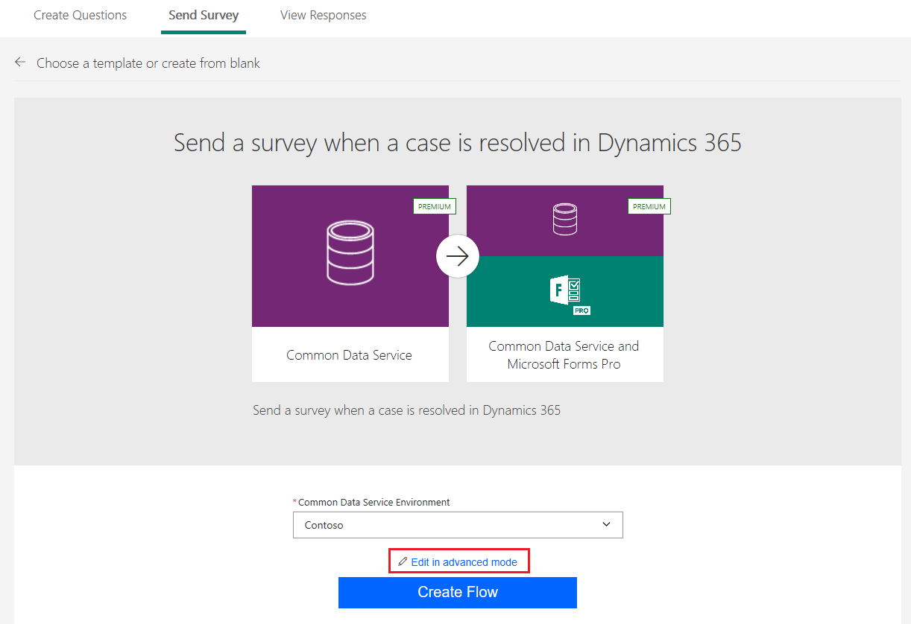
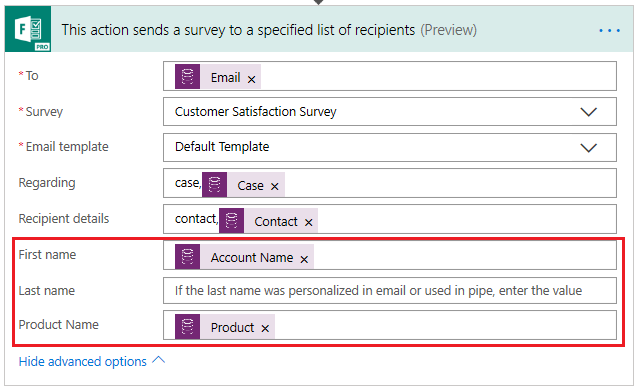

# Personalize a survey

[!include[cc-beta-prerelease-disclaimer](includes/cc-beta-prerelease-disclaimer.md)]

With placeholders, automatically insert customer information into your survey by using custom data. For example, you can use custom data to automatically insert a customer's first name into a question to personalize it.

By default, the following custom data options are available:

- First name
- Last name

To select or add a new custom data:

1.	Open the survey in which you want to use custom data.

2.	On the **Create Questions** tab, select the ellipsis button (…) from the toolbar at the top of the page, and then select **Personalize**.

    

3.	From the list of available personalized data, select the personalized data that you want to use in your survey.

4.	To add new personalized data, select **Add personalized data**.

5.	Enter a name for the personalized data.

6.	Select **Add**.

> [!NOTE]
> - You can also personalize survey invitations. More information: [Personalize an email](send-survey-email.md#personalize-an-email).
> - Don't use personalized data if you plan to send a survey anonymously. Placeholders will not be replaced with actual data in an anonymous survey.
> - Personalized data placeholders are replaced with the values specified in appropriate fields in a survey email.

## Add personalized data placeholders to a question

After selecting or adding the required personalized data, you need to associate that data with placeholders in the question. To add personalized data placeholders to a question:

1.	Open the survey in which you want to add personalized data placeholders.

2.	On the **Create Questions** tab, select the question text to which you want to add personalized data. The formatting toolbar appears.

3.	Place the cursor at the location where you want to add the personalized data placeholder.

4.	From the **Personalized** list in the formatting toolbar, select the personalized data that you want to add. 

    

For example, let's say that you've created personalized data named **Product Name** and that you want to display the customer's first name and the product name in a question. Select **First Name** and **Product Name** personalized data from the **Pipes** list. The *{{First Name}}* and *{{Product Name}}* placeholders are inserted at the cursor location.

Let's say the question is:
*{{First Name}}*, overall, how would you rate your experience with customer service for *{{Product Name}}*?

That question will look like this when a customer named Bert Hair takes the survey for a product named Contoso Sales:

Bert, overall, how would you rate your experience with customer service for Contoso Sales?

## Specify values for personalized data placeholders

After adding and using personalized data placeholders in a question, specify values for them. If you do not specify values for them, the placeholders are not replaced with the values and are displayed as is. You can specify the values for personalized data placeholders: 

- When sending an email.
- When configuring a flow.

### Specify values in an email

If you've added personalized data placeholders in an email, a section is displayed below the email editor. Select **Define personalized data** to expand the section and specify the values when sending email invitations.

### Specify values in a flow

To specify values for personalized data placeholders in a flow:

1.	While configuring a flow, select **Edit in advanced mode**.

    

2.	Go to the step that sends the survey, and expand it.

3.	Select **Show advanced options**.

    

4.	Specify the values for personalized data placeholders.

    

5.	Save the changes. 

## See also

[Create a new survey](create-new-survey.md) 
[Apply theme to a survey](apply-theme.md) 
[Preview and test a survey](preview-test-survey.md) 
[Create a branching rule](create-branching-rule.md) 
[Format text in a survey](survey-text-format.md) 
[Create a classic form](create-classic-form.md) 
[Create a multilingual survey](create-multilingual-survey.md) 
[Create a multipage survey](create-multipage-survey.md)
