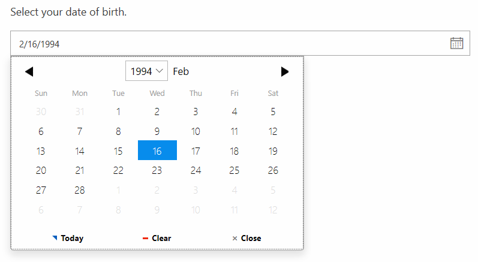
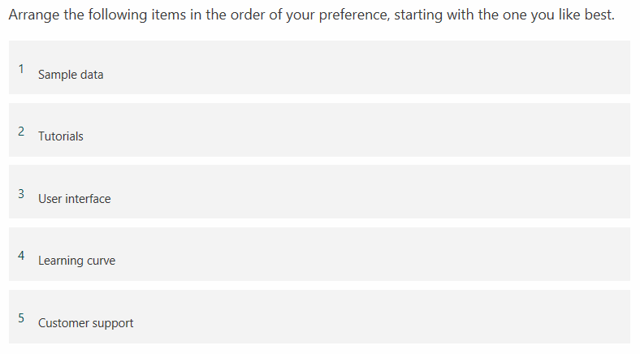

# Plan to create a survey

It's important to have a plan for creating your surveys. Here are a few things to think about when you're creating surveys:

-   How do you want to collaborate? For example, do you want to share the survey as a template or invite other people to collaborate?

-   What's the purpose of your survey? For example, you might want to interact with your customers, promote new products or services, or measure customer satisfaction. If your goal is to measure something, what and how do you want to measure it?

-   How long do you want the survey to be? Keep in mind that longer surveys tend to have higher abandon rates. A good rule of thumb is to keep surveys shorter than five minutes, or no longer than 10 questions (depending on the type of questions you ask).

-   How many mandatory questions will you include in the survey? We recommend that you ask as few mandatory questions as possible.

-   How do you want to distribute your survey? For example, do you want to distribute it through individual email, QR code, or do you want to automate?

## Best practices for creating a survey

A few best practices enable you to create a meaningful survey and gather good responses from your customers. You can then analyze those responses and act on them in a way that best suits your organization. Some of the best practices for creating a survey are:

- **Define an objective**: Having an objective allows you to properly plan for your survey. It also allows you to identify what results you expect from your customers. Knowing how you'll use the responses helps you pick the right questions for your survey.

- **Keep the survey short**: If you create a survey that takes a long time to complete, you might reduce your response rate.

- **Create a logical flow of questions**: Ensure that your survey has a logical flow of questions to keep respondents interested.

- **Organize the survey**: Group related questions together.

- **Preview the survey**: After creating your survey, always preview it to check the overall flow of the survey and to catch any mistakes.

- **Mention expectations in the survey invitation**: In the survey invitation, be sure to mention the estimated time to complete it and give a brief overview. This will help respondents submit their input within the expected time frame.

## Decide the question type

Deciding the question types while planning a survey helps you to create an organized survey and maintain a flow between the questions. The following table describes the question types available in Forms Pro.

- **Choice**: Question that allows a respondent to choose a single (radio button) or multiple (check box) answers. By default, the question is added as a single answer question. To change the question to multiple answers, move the **Multiple answers** toggle to the On position. You can also change the question type to drop-down by selecting **Drop-down** from **More settings for question** (...).

  **Single answer question**

  

  **Multiple answers question**

  

  **Drop-down question**

   

- **Text**: Question that has a one-line (short answer) or multiple lines (long answer) in the answer.   By default, the question is added as a short answer question. To change the question to long answer, move the **Long answer** toggle to the On position.

  **Short answer question**

  

  **Long answer question**

  

- **Rating**: Question that asks a respondent to provide ratings by using number, star, or smiley symbol. By default, star is selected. To change the symbol, select a symbol from the **Symbol** list. You can also change the level by selecting a value from the **Levels** list. For number and star, 10 levels are supported. For smiley, five levels are supported. You can also add labels for number and star symbols by selecting **Label** from **More settings for question** (...).

  **Star rating question**

   

  **Smiley rating question**

   

  **Number rating question**

  

- **Date**:  Question that asks a respondent to select a date.

  

- **Ranking**: Question that asks a respondent to rank answers in their order of preference.

  

- **Net Promoter Score**: Question that captures the satisfaction of the respondent based on the likelihood of their recommending the product or services to a friend.

  

- **Likert**: List of questions that allow a respondent to select one answer from a column of choices.

  

### See also

[Create a survey](create-survey.md) 
[Send a survey to get responses](send-survey.md)  
[Collaborate on a survey](collaborate-survey.md)  
[Analyze responses and invitations](analyze-responses-invites.md)  
[Work with environments](choose-environment.md) 
[Troubleshoot Forms Pro](troubleshoot.md)
