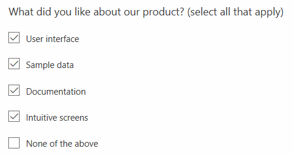
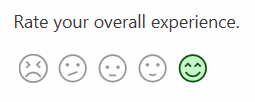

# Plan to create a survey

It's important to have a plan for creating your surveys. Here are a few things to think about when you're creating surveys:

-   How do you want to collaborate? For example, do you want to share the survey as a template or invite other people to collaborate?

-   What's the purpose of your survey? For example, you might want to interact with your customers, promote new products or services, or measure customer satisfaction. If your goal is to measure something, what and how do you want to measure it?

-   How long do you want the survey to be? Keep in mind that longer surveys tend to have higher abandon rates. A good rule of thumb is to keep surveys shorter than five minutes, or no longer than 10 questions (depending on the type of questions you ask).

-   How many mandatory questions will you include in the survey? We recommend that you ask as few mandatory questions as possible.

-   How do you want to distribute your survey? For example, do you want to distribute it through individual email, QR code, or do you want to automate?

## Best practices for creating a survey

A few best practices enable you to create a meaningful survey and gather good responses from your customers. You can then analyze those responses and act on them in a way that best suits your organization. Some of the best practices for creating a survey are:

- **Define an objective**: Having an objective allows you to properly plan for your survey. It also allows you to identify what results you expect from your customers. Knowing how you'll use the responses helps you pick the right questions for your survey.

- **Keep the survey short**: If you create a survey that takes a long time to complete, you might reduce your response rate.

- **Create a logical flow of questions**: Ensure that your survey has a logical flow of questions to keep respondents interested.

- **Organize the survey**: Group related questions together.

- **Preview the survey**: After creating your survey, always preview it to check the overall flow of the survey and to catch any mistakes.

- **Mention expectations in the survey invitation**: In the survey invitation, be sure to mention the estimated time to complete it and give a brief overview. This will help respondents submit their input within the expected time frame.

## Decide on the types of questions to ask

Deciding which types of questions you'll ask will help you organize your survey and maintain a good flow from one question to the next. The types of questions available in Forms Pro are Choice, Text, Rating, Date, Ranking, Net Promoter Score, and Likert.

### Choice

A Choice type question gives respondents a list of answers to choose from. You can decide whether to accept a single answer or multiple answers to the question. 

**Single-answer question**

By default, a choice question accepts a single answer. Respondents choose one answer from the list by selecting a radio button.

> [!div class=mx-imgBorder]
> 

In single-answer questions, you can also display the list of answers in a drop-down list rather than radio buttons. Select **More settings for question** (...), and then select **Drop-down**.

> [!div class=mx-imgBorder]
>  

**Multiple-answer question**

You can accept multiple answers for your question by turning on the **Multiple answers** toggle. Respondents choose one or more answers from the list by selecting one or more check boxes.

> [!div class=mx-imgBorder]
> 

### Text

A Text type question can accept a short (one-line) answer or a long (multiple-line) answer. 

**Short-answer question**

By default, a text question accepts a short answer.

> [!div class=mx-imgBorder]
> 

**Long-answer question**

You can accept multiple lines of text for your question by turning on the **Long answer** toggle.

> [!div class=mx-imgBorder]
> 

### Rating

A Rating type question asks respondents to rate their answer by using stars, numbers, or smiley symbols. 

By default, the star symbol is selected. To change the symbol, select it from the **Symbol** list. You can also change the number of levels by selecting a value from the **Levels** list. For number and star, up to 10 levels are supported. For smiley symbol, up to five levels are supported.

> [!NOTE]
> If you change the number of levels after sending the survey, the previously received responses will not be adjusted as per the new level. For example, you sent a survey with star rating question of five levels, and received five responses with 3-star rating. Later, if you change the number of levels to 10, the previously received responses with 3-star rating will not be adjusted to the 10-level scale.
  
Star and smiley rating questions with five levels are shown in the following images. 

> [!div class=mx-imgBorder]
>  

> [!div class=mx-imgBorder]
>  

For ratings questions that use numbers or stars, you can add labels for the numbers or stars by selecting **More settings for question** (...), and then selecting **Label**. A number rating question with labels is shown in the following image.

> [!div class=mx-imgBorder]
> 

### Date

A Date type question displays a calendar and asks the respondent to select a date.

> [!div class=mx-imgBorder]
> 

### Ranking

A Ranking type question asks a respondent to rank items by arranging them in the order of the respondent's preference.

> [!div class=mx-imgBorder]
> 

### Net Promoter Score

A Net Promoter Score type question asks a respondent to rate the likelihood of their recommending a product or service to a friend.

> [!div class=mx-imgBorder]
> 

### Likert

A Likert type question displays a list of single-answer questions and a rating scale for the answers, so a respondent can select a value from the scale to answer each question.

> [!div class=mx-imgBorder]
> 

### See also

[Create a survey](create-survey.md) 
[Send a survey to get responses](send-survey.md)  
[Collaborate on a survey](collaborate-survey.md)  
[Analyze responses and invitations](analyze-responses-invites.md)  
[Work with environments](choose-environment.md) 
[Troubleshoot Forms Pro](troubleshoot.md)