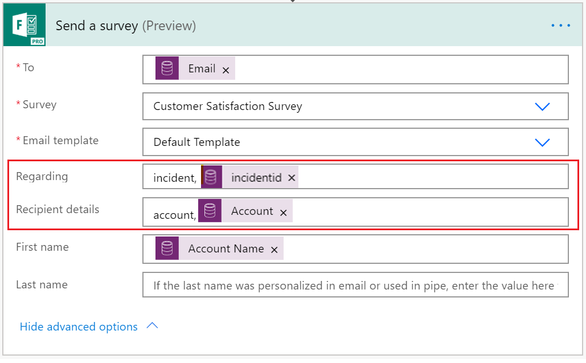

# Send a survey by using Microsoft Flow

[!include[cc-beta-prerelease-disclaimer](includes/cc-beta-prerelease-disclaimer.md)]

After creating a survey, you can send it to respondents based on a business trigger&#8212;resolution of a case or fulfillment of an order, for example. You can either select a built-in template or create a flow from scratch by using Microsoft Flow. The following flow templates are available out of the box in Forms Pro:

- **Send a survey when a case is resolved in Dynamics 365**: This template sends a survey when a case is resolved in Dynamics 365.
- **Send a survey when a lead is qualified in Dynamics 365**: This template sends a survey when a lead is qualified in Dynamics 365.
- **Send a survey when an order is fulfilled in Dynamics 365**: This template sends a survey when an order is fulfilled in Dynamics 365.
- **Send a survey when a button is clicked in PowerApps**: This template sends a survey to the specified list of recipients when a button is clicked in PowerApps.
- **Send a survey when a case is closed in Salesforce**: This template sends a survey when a case is closed in Salesforce.

To send a survey by using Microsoft Flow:

1.  Open the survey you want to send, and go to **Send Survey** &gt; **Microsoft Flow**.

2.  Compose the email.

3.  Select **Configure Flow**.

4.  To configure a built-in flow, select a template. For information on creating a flow from a template, see [Create a flow from a template in Microsoft Flow](https://docs.microsoft.com/en-us/flow/get-started-logic-template). 

5.  To create a flow from scratch, select **Create from blank**. For information on creating a flow from scratch, see [Create a flow in Microsoft Flow](https://docs.microsoft.com/en-us/flow/get-started-logic-flow).

> [!NOTE]
> - While configuring a flow, the template page might display duplicate templates. To resolve this issue, navigate out of the **Send Survey** tab, and then come back to create the flow again.
> - If you have added personalized data in your survey, you must specify their values in the flow. More information: [Specify values in a flow](personalize-survey.md#specify-values-in-a-flow)

5.  Select **Create Flow**.

## View flow history

Flow history is the information that is stored for each survey as you configure flows to send a survey. Before configuring a new flow, you might want to know more about the flows that are already configured for the survey. Flow history gives you the required information about the configured flows, such as the total number of runs, failures, and so on.

Flow history is displayed in a grid with the following information:

- **Date modified**: Date when the flow was modified.

- **Flow**: Name of the flow.

- **Message template**: Email message template(s) used by the flow.

- **Runs**: Total number of times a flow has run. Values of up to 200 are displayed. If a flow has run more than 200 times, 200+ is displayed as the count. You can select the count value to view more details about the run.

- **Failures (last 200 runs)**: Number of times a flow has failed out of the last 200 runs.

- **Status**: Status of the flow: on or off. You can update a flow’s status from Microsoft Flow. For more information, see [Manage a flow](https://docs.microsoft.com/en-us/flow/get-started-logic-flow#manage-a-flow).  

If required, you can also edit a flow by selecting the **Edit** symbol. The flow editor opens in Microsoft Flow, from which you make your changes.

> [!div class=mx-imgBorder]
>   

To view flow history:

1.  Open the survey for which you want to view flow history, and go to **Send Survey** &gt; **Microsoft Flow**.

2.  On the **Send Survey** tab, select **Flow history**   from the toolbar at the top of the page.

    A grid with the configured flows is displayed.

    > [!div class=mx-imgBorder]
    >   

## Associate survey invitation and response with Common Data service

While creating a Flow to automate survey emails, you can associate your survey invitation and response with Common Data service. This can be achieved through the **Regarding** and **Recipient** fields in a flow.

Let's say you need to send a survey on every case closure. You can use the **Regarding** field to specify the case record so that when an invitation and response are created on a particular case resolution, they are attached to the specific case. The case manager can then setup reports to show Customer Satisfaction (CSAT) scores by case or reopen a case if the CSAT is very low.

The **Recipient** field allows you associate your survey invitation and response records to the appropriate contact (the recipient). This allows sales personnel or anyone to see the contact record and know the response of the customer. This can help formulate their conversation with the customer accordingly.

To associate survey invitation and response with Common Data service:

1.	While configuring a flow select **Create from blank** to create a flow from scratch. For information on creating a flow from scratch, see [Create a flow in Microsoft Flow](https://docs.microsoft.com/en-us/flow/get-started-logic-flow).

    > [!NOTE]
    > If you choose to create a flow from a template, the **Regarding** and **Recipient** fields are populated accordingly.

2.	In the step that sends the survey, enter the mandatory information.

3.	Select **Show advanced options**.

4.	Specify values in the **Regarding** and **Recipient** fields.

    > [!div class=mx-imgBorder]
    >   

5.	Save the changes.

## See also

[Define who can respond to a survey](invite-settings.md) 
[Send a survey by using email](send-survey-email.md) 
[Embed in a web page](embed-web-page.md) 
[Send a survey link to others](send-survey-link.md) 
[Send a survey QR code](send-survey-qrcode.md)
